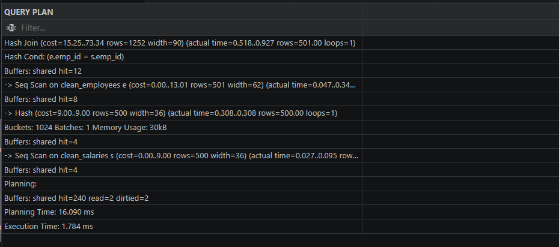
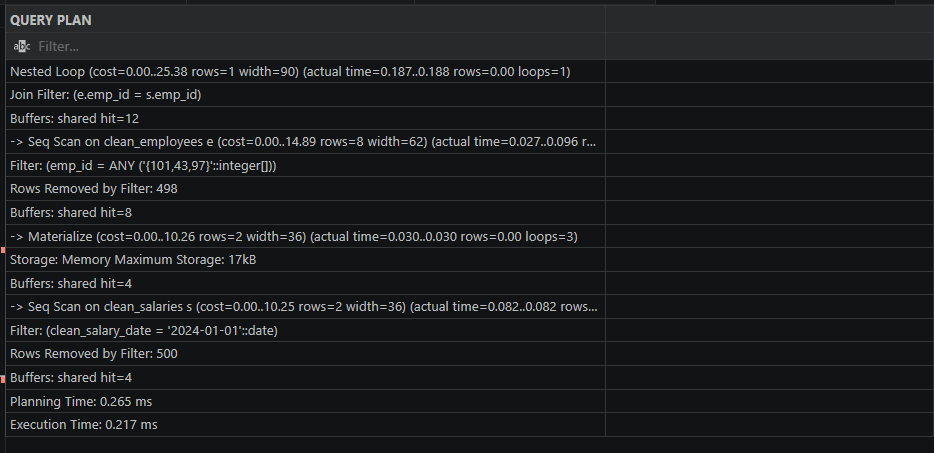
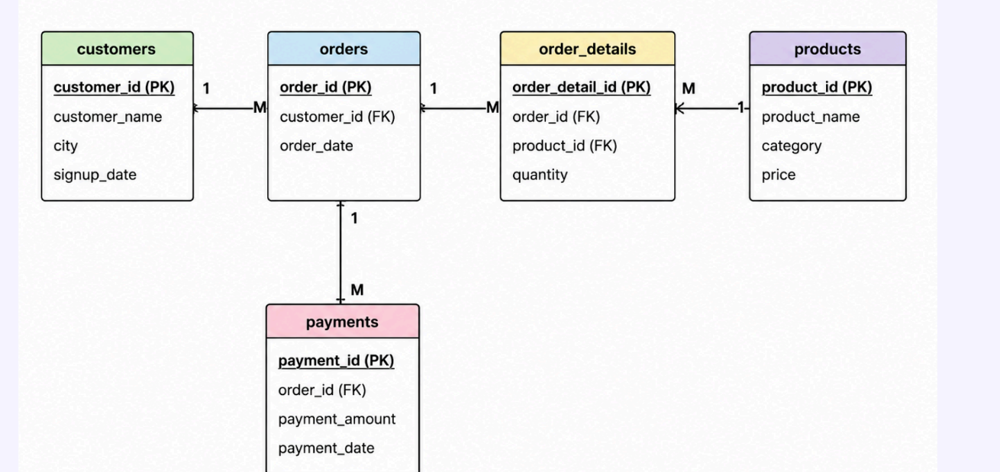
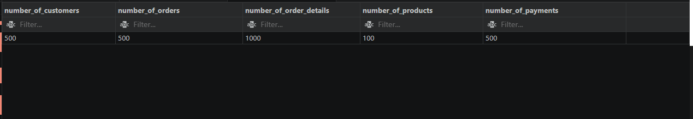

# 50 DAYS SQL - PRACTICE CHALLENGE


| Performance as at 10th June | Performance as at 15th June |
| --- | --- |
|  |  |


[Datapencil challenge](https://datapencil.org/50-days-sql-challenge)


## Table of content

| Days 1–10 | Days 11–20 | Days 21–30 | Days 31–40 | Days 41–50 |
| :--- | :--- | :--- | :--- | :--- |
| [Day 1: Project Setup](#day-1-project-setup) | [Day 11: Relational Integrations and Grouped Metric Aggregations](#day-11-relational-integrations-and-grouped-metric-aggregations) | [Day 21: Fetching Top-N Records](#day-21-fetching-top-n-records) | [Day 31: Advanced SQL Queries & CTEs](#day-31-advanced-sql-queries--ctes) | [Day 41: SQL Project](#day-41-sql-project) |
| [Day 2: Data Audit](#day-2-data-audit-messiness-detection) | [Day 12: Intersection Sets and Left Outer Extensions](#day-12-intersection-sets-and-left-outer-extensions) | [Day 22: Common Table Expressions and Windowed Averages](#day-22-common-table-expressions-and-windowed-averages) | [Day 32: Database Views part 1](#day-32-database-views-part-1) | [Day 42: Data Cleaning](#day-42-data-cleaning) |
| [Day 3: Missing Values](#day-3-data-cleaning-handling-missing-values) | [Day 13: subqueries and aggregate functions](#day-13-subqueries-and-aggregate-functions) | [Day 23: Historical Trends and Previous-Value Comparisons](#day-23-historical-trends-and-previous-value-comparisons) | [Day 32: Database Views part 2](#day-32-database-views-part-2) | [Day 43](#day-43) |
| [Day 4: Inconsistent Text](#day-4-data-cleaning-handling-inconsistent-text) | [Day 14: Nested Query Expressions](#day-14-nested-query-expressions) | [Day 24: Sequential Trends and Next-Value Comparisons](#day-24-sequential-trends-and-next-value-comparisons) | [Day 34: SQL Database Optimization(INDEX)](#day-34-sql-database-optimizationindex) | [Day 44](#day-44) |
| [Day 5: Invalid Values](#day-5-data-cleaning-handling-invalid-values) | [Day 15: semi-joins and anti-joins](#day-15-semi-joins-and-anti-joins) | [Day 25: Window Aggregates and Cumulative Analytics](#day-25-window-aggregates-and-cumulative-analytics) | [Day 35: Database Query Optimization Part 2](#day-35-database-query-optimization-part-2) | [Day 45](#day-45) |
| [Day 6: Outlier Detection](#day-6-data-cleaning-outlier-detection--handling) | [Day 16: Multi-Table Aggregations](#day-16-multi-table-aggregations) | [Day 26: Window Ranking Functions](#day-26-window-ranking-functions) | [Day 36: Stored procedures part 1](#day-36-stored-procedures-part-1) | [Day 46](#day-46) |
| [Day 7: Date Formatting](#day-7-data-cleaning) | [Day 17: Filtering Aggregated Result Sets](#day-17-filtering-aggregated-result-sets) | [Day 27: Conditional Query Logic](#day-27-conditional-query-logic) | [Day 37: Stored procedures part 2](#day-37-stored-procedures-part-2) | [Day 47](#day-47) |
| [Day 8: Datatypes & Spaces](#day-8-data-cleaning) | [Day 18: Multi-Table Joins and Key Matching](#day-18-multi-table-joins-and-key-matching) | [Day 28: Advanced Analytics](#day-28-advanced-analytics)| [Day 38: Triggers Before Update and After Insert](#day-38-triggers-before-update-and-after-insert) | [Day 48](#day-48) |
| [Day 9: Basic SQL Tasks](#day-9-sql-tasks) | [Day 19: Data Classification and Logical Flags](#day-19-data-classification-and-logical-flags) | [Day 29: Advanced Analytics](#day-29-advanced-analytics) | [Day 39: Triggers Functions](#day-39-triggers-functions) | [Day 49](#day-49) |
| [Day 10: Joins & Analysis](#day-10-joins-and-data-analysis) | [Day 20: Window Ranking Functions](#day-20-window-ranking-functions) | [Day 30: Common Table Expressions and Windowed Functions](#day-30-common-table-expressions-and-windowed-functions) | [Day 40: Creating Temporary Tables](#day-40-creating-temporary-tables) | [Day 50](#day-50) |

***

## Day 1: Project Setup

### Objective
Set up the SQL project environment and prepare the dataset for analysis.

### Tasks Completed
- Created project folder structure (dataset, SQL_QUERIES, screenshots)
- Set up SQL database (hr_project)
- Created tables for HR dataset
- Imported messy dataset into database

### Tools Used
- PostgreSQL
- VS Code
- GitHub
- Python 3.13.3

### Outcome
Successfully completed project setup. Ready to start data cleaning and analysis from Day 2.

## Day 2: Data Audit (Messiness Detection)

### Objective
Identify data issues across all tables and columns.

### Tasks Completed
Created cleaned tables
Identified NULL and empty values

### Results/Findings
**Employees and performance** table have empty and NULL values


## Day 3: Data Cleaning (Handling Missing Values)

### Objective
Clean the dataset by handling missing values across multiple tables.

### Tasks Completed
- Created cleaned versions of tables (employees_clean, departments_clean, performance_clean)
- Converted empty values into NULL for consistency
- Replaced NULL and empty values with appropriate defaults

### Key Learning
- NULL and empty values are different but both need to be handled
- Data should not be cleaned directly in raw tables
- Business rules are important while filling missing values


## Day 4: Data Cleaning (Handling Inconsistent Text)
### Objective
* Clean the dataset by fixing inconsistent text values across columns.

### Tasks Completed
1. Identified inconsistent text formats (e.g., HR, hr, Hr)
2. Standardized text using functions like `UPPER()`, `LOWER()`, `INITCAP()`
3. Trimmed extra spaces using TRIM()
4. Replaced incorrect spellings and variations
5. Ensured uniform naming conventions across tables

### Key Learning
* Text inconsistency affects grouping and analysis
* Same values with different formats behave as different data
* Standardization is critical before applying aggregations

## Day 5: Data Cleaning (Handling Invalid Values)
### Objective
* Identify and fix logically incorrect or invalid values in the dataset.
### Tasks Completed
1. Detected invalid values (negative salary, invalid age, incorrect ratings)
2. Applied business rules to define valid ranges
3. Replaced incorrect values using client-provided data
4. Ensured no assumption-based fixes were applied
### Key Learning
* Invalid values are not always missing but logically incorrect
* Data should be corrected using trusted sources (client/system)
* Never blindly manipulate values without business context

## Day 6: Data Cleaning (Outlier Detection & Handling)
### Objective
* Identify and handle extreme values (outliers) in the dataset.

### Outlier Analysis & Updates

1. High Earners Query (Above 75th Percentile)

* This query filters the dataset to identify all employees whose salaries are strictly greater than the **75th percentile (Q3)**. It uses an aggregate subquery with `PERCENTILE_CONT` to dynamically calculate the threshold.

```sql
SELECT * 
FROM challenge_50.clean_salaries
WHERE salary > (
    SELECT PERCENTILE_CONT(0.75) WITHIN GROUP (ORDER BY salary) 
    FROM challenge_50.clean_salaries
);
```

2. Bulk Salary Updates
* This script performs a targeted batch update on specific employee records. It uses a virtual table constructor (`VALUES`) to scale updates efficiently without executing multiple separate `UPDATE` statements.

```sql
UPDATE challenge_50.clean_salaries AS s
SET salary = n.salary
FROM (VALUES
    (17, 35, 65000),
    (37, 262, 97000)
) AS n(salary_id, emp_id, salary)
WHERE s.salary_id = n.salary_id;
```


### Key Learning
* Not all outliers are errors — some are meaningful


---
## Day 7: Data Cleaning
### Objective: Date format fixing
### Task completed
* Identified inconsistent date formats in multiple columns (salary_date, attendance_date, hire_date)
* Detected invalid values (e.g., wrong month, incomplete year, incorrect patterns)
* Replaced incorrect dates with NULL to avoid misleading data
* Standardized all valid dates into a uniform format (YYYY-MM-DD)
* Ensured consistency across all date-related columns

---
## Day 8: Data Cleaning

### Objective:Fix Datatype & Fix Space Issue

* Removed unwanted spaces using `TRIM()` to ensure consistency
* Checked data types across all tables **(employees, departments, salary, performance, attendance)**
* Converted columns to appropriate data types **(INT, VARCHAR, DATE, NUMERIC)**
* Validating data types conversion

---
## Day 9: SQL Tasks
1.  Show only employees who have a valid department
2.  Show all employees (even without department)
3.  Find employees without department
4.  Find who earns how much
5.  List salary records paid to unknown names

---

## Day 10: Joins and Data Analysis

This file contains the SQL queries for the Day 10 challenges, focusing on table joins.


**1. Question:** What are the performance ratings of each employee?

```sql
SELECT 
    e.emp_id, 
    e.emp_name, 
    p.rating_2022, 
    p.rating_2023, 
    p.rating_2024 
FROM challenge_50.clean_employees e 
JOIN challenge_50.clean_performance p ON e.emp_id = p.emp_id;
```

**2. Question:** Which employees do not have any salary records?
```sql
SELECT 
    e.emp_id, 
    e.emp_name, 
    s.salary 
FROM challenge_50.clean_employees e 
LEFT JOIN challenge_50.clean_salaries s ON s.emp_id = e.emp_id 
WHERE s.emp_id IS NULL;
```

**3. Question:** Which employees do not have any attendance records?
```sql
SELECT 
    e.emp_id, 
    e.emp_name, 
    a.status 
FROM challenge_50.clean_employees e 
LEFT JOIN challenge_50.clean_attendance a ON a.emp_id = e.emp_id 
WHERE a.emp_id IS NULL;
```

**4. Question:** What is the employee name, department, and salary together?
```sql
SELECT 
    e.emp_name, 
    d.dept_name, 
    s.salary 
FROM challenge_50.clean_employees e 
JOIN challenge_50.clean_departments d ON d.dept_id = e.dept_id 
JOIN challenge_50.clean_salaries s ON s.emp_id = e.emp_id;
```

---

## Day 11: Relational Integrations and Grouped Metric Aggregations

The focus of today's challenge is `(INNER JOIN and LEFT JOIN)`, data aggregation`(COUNT, SUM)`, and grouping techniques

### Tasks and Solutions

**Task 1: Employee Performance Overview**


```sql

--Retrieve the employee name, department, and performance ratings for the years 2022, 2023, and 2024.
SELECT 
    e.emp_name, 
    d.dept_name, 
    p.rating_2022, 
    p.rating_2023, 
    p.rating_2024 
FROM challenge_50.clean_employees e 
JOIN challenge_50.clean_performance p ON p.emp_id = e.emp_id 
JOIN challenge_50.clean_departments d ON d.dept_id = e.dept_id;
```

**Task 2: Complete Employee Profile** 


```sql

-- Build a comprehensive profile for each employee, including their department, salary details, and historical performance ratings.

SELECT 
    e.emp_name, 
    d.dept_name, 
    s.salary, 
    p.rating_2022, 
    p.rating_2023, 
    p.rating_2024 
FROM challenge_50.clean_employees e 
LEFT JOIN challenge_50.clean_performance p ON p.emp_id = e.emp_id 
JOIN challenge_50.clean_departments d ON d.dept_id = e.dept_id 
JOIN challenge_50.clean_salaries s ON s.emp_id = e.emp_id;
```

**Task 3: Salary Record Count per Employee**


```sql

-- Determine how many individual salary history records exist for each employee, ordered by their unique employee ID.

SELECT 
    e.emp_id, 
    e.emp_name, 
    COUNT(s.salary) AS count_salary_records 
FROM challenge_50.clean_employees e 
LEFT JOIN challenge_50.clean_salaries s ON s.emp_id = e.emp_id 
GROUP BY e.emp_id, e.emp_name 
ORDER BY e.emp_id ASC;
```

**Task 4: Total Salary Expenditure per Employee**


```sql
-- Calculate the cumulative total salary paid out to each employee across all of their available historical records.


SELECT 
    e.emp_id, 
    e.emp_name, 
    SUM(s.salary) AS total_salary 
FROM challenge_50.clean_employees e 
LEFT JOIN challenge_50.clean_salaries s ON s.emp_id = e.emp_id 
GROUP BY e.emp_id, e.emp_name 
ORDER BY e.emp_id ASC;
```

---
## Day 12: Intersection Sets and Left Outer Extensions

---

## Task 1: Average Salary by Department


```sql
-- Calculate the average salary for each department and sort the results from lowest to highest.

SELECT 
    d.dept_name, 
    ROUND(AVG(s.salary), 2) AS average_salary 
FROM challenge_50.clean_departments AS d 
JOIN challenge_50.clean_employees AS e ON e.dept_id = d.dept_id 
JOIN challenge_50.clean_salaries AS s ON s.emp_id = e.emp_id 
GROUP BY d.dept_name 
ORDER BY average_salary;
```

---

### Task 2: Employee Attendance Tracking


```sql
--  Count how many days each employee was present using a conditional block.

SELECT 
    e.emp_id, 
    e.emp_name, 
    COUNT(a.clean_attendance_date) FILTER(WHERE a.status = 'Present') AS days_present 
FROM challenge_50.clean_employees AS e 
LEFT JOIN challenge_50.clean_attendance AS a ON e.emp_id = a.emp_id 
GROUP BY e.emp_id, e.emp_name 
ORDER BY e.emp_id;
```

---

### Task 3: Department Roster Grouping


```sql
-- Collect and string-aggregate all active employee names who belong to the same department.

SELECT 
    d.dept_name,
    STRING_AGG(e.emp_name, ', ') AS employees
FROM challenge_50.clean_departments AS d 
JOIN challenge_50.clean_employees AS e ON e.dept_id = d.dept_id 
WHERE e.emp_name != 'Unknown' 
GROUP BY d.dept_name;
```

---

### Task 4: Multi Salary Record Detection


```sql
-- Identify employees who have more than one historical salary entry without using slow nested subqueries.
SELECT 
    e.emp_name 
FROM challenge_50.clean_employees AS e 
JOIN challenge_50.clean_salaries AS s ON s.emp_id = e.emp_id 
GROUP BY e.emp_id, e.emp_name 
HAVING COUNT(s.salary) > 1;
```
---

## Day 13: subqueries and aggregate functions


Useing subqueries and aggregate functions (`AVG`, `MAX`, `MIN`) to filter employee records based on salary thresholds from a separate table.

---

### 1. Employees Earning More Than Average Salary
Retrieves names of employees whose salary is strictly above the company-wide average.

```sql
-- List employees earning more than average salary 
SELECT e.emp_name 
FROM challenge_50.clean_employees e 
WHERE e.emp_id IN (
    SELECT s.emp_id 
    FROM challenge_50.clean_salaries s 
    WHERE s.salary > (
        SELECT AVG(s.salary) 
        FROM challenge_50.clean_salaries s
    )
);
```

---

### 2. Employees with Maximum Salary
Retrieves names of employees who earn the absolute highest salary in the database.

```sql
-- List employees with salary equal to maximum salary 
SELECT e.emp_name 
FROM challenge_50.clean_employees e 
WHERE e.emp_id = ALL (
    SELECT s.emp_id 
    FROM challenge_50.clean_salaries s 
    WHERE s.salary = (
        SELECT MAX(s.salary) 
        FROM challenge_50.clean_salaries s
    )
);
```
---

### 3. Employees Earning Less Than Average Salary
Retrieves names of employees whose salary falls below the company-wide average.

```sql
-- List employees earning less than average 
SELECT e.emp_name 
FROM challenge_50.clean_employees e 
WHERE e.emp_id IN (
    SELECT s.emp_id 
    FROM challenge_50.clean_salaries s 
    WHERE s.salary < (
        SELECT AVG(s.salary) 
        FROM challenge_50.clean_salaries s
    )
);
```

---

### 4. Employees with Minimum Salary
Retrieves names of employees earning the absolute lowest salary in the database.

```sql
-- List employees with minimum salary 
SELECT e.emp_name 
FROM challenge_50.clean_employees e 
WHERE e.emp_id = ALL (
    SELECT s.emp_id 
    FROM challenge_50.clean_salaries s 
    WHERE s.salary = (
        SELECT MIN(s.salary) 
        FROM challenge_50.clean_salaries s
    )
);
```

---

## Day 14: Nested Query Expressions

### **Task 1:** List employees earning more than the average salary of their respective departments.

```sql
SELECT 
    e.dept_id, 
    e.emp_name, 
    s.salary 
FROM challenge_50.clean_employees e 
JOIN challenge_50.clean_salaries s 
    ON s.emp_id = e.emp_id 
WHERE salary > (
    SELECT AVG(s2.salary) 
    FROM challenge_50.clean_employees e2 
    JOIN challenge_50.clean_salaries s2 
        ON s2.emp_id = e2.emp_id 
    WHERE e2.dept_id = e.dept_id
);
```

---

### **Task 2:** List employees whose salary is equal to the highest salary in their respective departments.

```sql
SELECT 
    e.dept_id, 
    e.emp_name, 
    s.salary 
FROM challenge_50.clean_employees e 
JOIN challenge_50.clean_salaries s 
    ON s.emp_id = e.emp_id 
WHERE salary = (
    SELECT MAX(s2.salary) 
    FROM challenge_50.clean_employees e2 
    JOIN challenge_50.clean_salaries s2 
        ON s2.emp_id = e2.emp_id 
    WHERE e2.dept_id = e.dept_id
);
```

---

### **Task 3:** List all employees whose salary is equal to the lowest salary in their respective departments.

```sql
SELECT 
    e.dept_id, 
    e.emp_name, 
    s.salary 
FROM challenge_50.clean_employees e 
JOIN challenge_50.clean_salaries s 
    ON s.emp_id = e.emp_id 
WHERE salary = (
    SELECT MIN(s2.salary) 
    FROM challenge_50.clean_employees e2 
    JOIN challenge_50.clean_salaries s2 
        ON s2.emp_id = e2.emp_id 
    WHERE e2.dept_id = e.dept_id
);
```
---


## Day 15: semi-joins and anti-joins

Today's focus is on using semi-joins and anti-joins via `EXISTS` and `NOT EXISTS`. 

### **Task 1:**  Employees With Salary Records
This query returns all employees who have at least one corresponding record in the salaries table.

```sql
SELECT 
    e.emp_id, 
    e.emp_name 
FROM 
    challenge_50.clean_employees e 
WHERE 
    EXISTS (
        SELECT 1 
        FROM challenge_50.clean_salaries s 
        WHERE e.emp_id = s.emp_id
    ) 
ORDER BY 
    e.emp_id;
```

### **Task 2:**  Employees Without Salary Records
This query identifies employees who have no recorded salary history.

```sql
SELECT 
    e.emp_id,
    e.emp_name 
FROM 
    challenge_50.clean_employees e 
WHERE 
    NOT EXISTS (
        SELECT 1 
        FROM challenge_50.clean_salaries s 
        WHERE s.emp_id = e.emp_id
    ) 
ORDER BY 
    e.emp_id;
```

### **Task 4:**  Employees With Attendance Records
This query lists all employees who have logged at least one attendance entry.

```sql
SELECT 
    e.emp_id,
    e.emp_name 
FROM 
    challenge_50.clean_employees e 
WHERE 
    EXISTS (
        SELECT 1 
        FROM challenge_50.clean_attendance a 
        WHERE a.emp_id = e.emp_id
    ) 
ORDER BY 
    e.emp_id;
```
### **Task 5:** Employees Without Attendance Records


```sql
SELECT 
    e.emp_id,
    e.emp_name 
FROM 
    challenge_50.clean_employees e 
WHERE 
    NOT EXISTS (
        SELECT 1 
        FROM challenge_50.clean_attendance a 
        WHERE a.emp_id = e.emp_id
    ) 
ORDER BY 
    e.emp_id;
```
---


## Day 16: Multi-Table Aggregations

### **Task 1 :** Calculate total salary paid to each employee


```sql
SELECT 
    e.emp_id,
    e.emp_name, 
    SUM(s.salary) AS total_salary_paid
FROM challenge_50.clean_salaries s
JOIN challenge_50.clean_employees e ON s.emp_id = e.emp_id
GROUP BY e.emp_id, e.emp_name;
```

### **Task 2 :** Average Salary Received by Each Employee

```sql
SELECT 
    e.emp_id,
    e.emp_name, 
    AVG(s.salary) AS average_salary
FROM challenge_50.clean_salaries s
JOIN challenge_50.clean_employees e ON s.emp_id = e.emp_id
GROUP BY e.emp_id, e.emp_name;
```

## **Task 3.** Find maximum salary received by each employee 


```sql
SELECT 
    e.emp_id,
    e.emp_name, 
    MAX(s.salary) AS max_salary
FROM challenge_50.clean_salaries s
JOIN challenge_50.clean_employees e ON s.emp_id = e.emp_id
GROUP BY e.emp_id, e.emp_name;
```

---

## Day 17: Filtering Aggregated Result Sets

### **Task 1 :** List employees with more than 2 salary records

```sql
SELECT 
    emp_id ,
    COUNT(*) AS emp_count FROM
challenge_50.clean_salaries
GROUP BY emp_id
HAVING COUNT(*) >2;
```
### **Task 2 :** List departments with more than 3employees


```sql
SELECT 
    dept_id,
    COUNT(*) 
FROM challenge_50.clean_employees
GROUP BY dept_id
HAVING COUNT(*) >3
ORDER BY dept_id;
```

### **Task 3 :** List employees with total salary greater than 100000

```sql
SELECT 
    emp_id,
    sum(salary) AS total_salary
FROM challenge_50.clean_salaries
GROUP BY emp_id
HAVING sum(salary)> 100000
ORDER BY emp_id;
```


### **Task 4 :** List departments with high average salary (greater than 50000)

```sql
SELECT 
    emp_id,
    ROUND(AVG(salary),2) AS avg_salary
FROM challenge_50.clean_salaries
GROUP BY emp_id
HAVING AVG(salary)> 50000
ORDER BY emp_id;
```
---
## Day 18: Multi-Table Joins and Key Matching

### 1. High Performing Employees
Employees with an average performance rating greater than 4.

```sql
SELECT 
    e.emp_id, 
    e.emp_name, 
    d.dept_name, 
    ROUND(((p.rating_2022 + p.rating_2023 + p.rating_2024) / 3), 0) AS performance_avg 
FROM challenge_50.clean_employees e 
JOIN challenge_50.clean_performance p ON p.emp_id = e.emp_id 
JOIN challenge_50.clean_departments d ON d.dept_id = e.dept_id 
WHERE ROUND(((p.rating_2022 + p.rating_2023 + p.rating_2024) / 3), 0) > 4;
```

### 2. High Attendance Employees
Employees with more than 10 present days.

```sql
SELECT 
    e.emp_id, 
    e.emp_name, 
    COUNT(a.status) FILTER(WHERE a.status = 'Present') AS present_days 
FROM challenge_50.clean_employees e
JOIN challenge_50.clean_attendance a ON e.emp_id = a.emp_id
GROUP BY e.emp_id, e.emp_name 
HAVING COUNT(a.status) FILTER(WHERE a.status = 'Present') > 10;
```

### 3. High Budget Departments
Departments where the total salary paid is greater than 200,000.

```sql
SELECT 
    d.dept_id, 
    d.dept_name, 
    SUM(s.salary) AS total_salary
FROM challenge_50.clean_employees e 
JOIN challenge_50.clean_departments d ON d.dept_id = e.dept_id 
JOIN challenge_50.clean_salaries s ON e.emp_id = s.emp_id 
GROUP BY d.dept_id, d.dept_name 
HAVING SUM(s.salary) > 200000;
```

### 4. Above Average Earners
Employees whose total salary is greater than their department's average salary.

```sql
SELECT 
    e.emp_id, 
    e.emp_name, 
    SUM(s.salary) AS total_salary
FROM challenge_50.clean_employees e 
JOIN challenge_50.clean_salaries s ON e.emp_id = s.emp_id 
GROUP BY e.emp_id, e.emp_name 
HAVING SUM(s.salary) > ANY (
    SELECT AVG(s2.salary) 
    FROM challenge_50.clean_employees e2 
    JOIN challenge_50.clean_salaries s2 ON e2.emp_id = s2.emp_id 
    WHERE e2.dept_id = (SELECT dept_id FROM challenge_50.clean_employees WHERE emp_id = e.emp_id)
);
```

---
## Day 19: Data Classification and Logical Flags

### Employee Categorization Queries
---

### 1. Salary Categorization (Low / Medium / High)
Categorizes employees based on their current salary threshold.

```sql
SELECT 
    emp_id,
    salary,
    CASE 
        WHEN salary < 30000 THEN 'Low'
        WHEN salary BETWEEN 30000 AND 60000 THEN 'Medium'
        WHEN salary > 60000 THEN 'High'
        ELSE 'N/A'
    END AS salary_category
FROM challenge_50.clean_salaries;
```

---

### 2. Performance Categorization (Good / Average / Poor)
Calculates the 3-year average rating (2022-2024) to determine overall performance.

```sql
SELECT 
    emp_id,
    CASE 
        WHEN ((rating_2022 + rating_2023 + rating_2024) / 3.0) >= 4 THEN 'Good'
        WHEN ((rating_2022 + rating_2023 + rating_2024) / 3.0) >= 3 THEN 'Average'
        ELSE 'Poor'
    END AS performance_category
FROM challenge_50.clean_performance;
```

---

### 3. Attendance Status Categorization (Active / Inactive)
Flags employee status based on their presence record.

```sql
SELECT 
    emp_id,
    CASE 
        WHEN status = 'Present' THEN 'Active'
        ELSE 'Inactive'
    END AS attendance_status
FROM challenge_50.clean_attendance;
```

---

### 4. Experience Level Categorization (Fresher / Mid-Level / Experienced)
Tracks career tenure tiers based on the employee's original hire date.

```sql
SELECT 
    emp_id,
    clean_hire_date,
    CASE 
        WHEN EXTRACT(YEAR FROM AGE(NOW(), clean_hire_date)) < 2 THEN 'Fresher'
        WHEN EXTRACT(YEAR FROM AGE(NOW(), clean_hire_date)) BETWEEN 2 AND 5 THEN 'Mid-Level'
        ELSE 'Experienced'
    END AS experience_level
FROM challenge_50.clean_employees;
```

---


## Day 20: Window Ranking Functions

### **Task 1 :** Retrieve latest salary record for each employee

```SQL
WITH cte AS
(
SELECT 
emp_id,
salary,
clean_salary_date,
ROW_NUMBER() OVER(PARTITION BY emp_id ORDER BY clean_salary_date DESC) AS order_rank
FROM challenge_50.clean_salaries
)
SELECT emp_id,salary,clean_salary_date FROM cte
WHERE order_rank = 1;
```


### **Task 2 :** Retrieve first(oldest) salary record for each employee

```SQL
SELECT * FROM
(
    SELECT 
    emp_id,
    salary,
    clean_salary_date,
    ROW_NUMBER() OVER(PARTITION BY emp_id ORDER BY clean_salary_date ASC) AS order_rank
    FROM challenge_50.clean_salaries
)
WHERE order_rank = 1;
```

### **Task 3 :** Rank salary entries for each employee

```SQL
SELECT 
    emp_id,
    salary,
    clean_salary_date,
    RANK() OVER(ORDER BY salary ASC) AS salary_rank
FROM challenge_50.clean_salaries
```

### **Task 4 :** Get top 2 salary records per employee

```SQL
WITH cte AS
(
    SELECT 
    emp_id,
    salary,
    clean_salary_date,
    ROW_NUMBER() OVER(PARTITION BY emp_id ORDER BY salary DESC) AS order_rank
    FROM challenge_50.clean_salaries
)
SELECT emp_id,salary,clean_salary_date,order_rank FROM cte
WHERE order_rank IN (1,2);
```
---


## Day 21:Fetching Top-N Records

### **Task 1 :** Rank employees based on salary
```SQL
SELECT
    emp_id,
    salary,
    RANK()OVER(ORDER BY salary) "Rank employees based on salary"
FROM challenge_50.clean_salaries
LIMIT 10;
```

**Output:**


### **Task 2 :** Perform department-wise ranking of employees

```SQL
SELECT
    e.emp_id,
    e.emp_name,
    e.dept_id,
    s.salary,
    DENSE_RANK()OVER(PARTITION BY e.dept_id ORDER BY s.salary) "department-wise ranking of employees"
FROM challenge_50.clean_employees e
JOIN challenge_50.clean_salaries s
ON s.emp_id = e.emp_id;
```

### **Task 3 :** Identify top performers based on average performance rating

```SQL
SELECT 
    emp_name,
    avg_performance,
    DENSE_RANK()OVER(ORDER BY avg_performance DESC) "top performers based on average performanc"
FROM(
    SELECT
    e.emp_id,
    e.emp_name,
    ((p.rating_2022+p.rating_2023+p.rating_2024)/3) Avg_performance 
    FROM challenge_50.clean_performance p
    JOIN challenge_50.clean_employees e
    ON e.emp_id = p.emp_id
)
LIMIT 10;
```


**Output:**


### **Task 4 :** Find top 3 employees based on salary ranking

```SQL
SELECT
    salary,
    RANK()OVER(ORDER BY salary) "top 3 employees based on salary"
FROM challenge_50.clean_salaries
ORDER BY salary DESC
LIMIT 3;
```

**Output:**


---


## Day 22: Common Table Expressions and Windowed Averages


### **Task 1:** Show each employee with average salary of their department

```sql
-- • Show each employee with average salary of their department
WITH cte AS
(
    SELECT 
        e.emp_id,
        e.dept_id,
        s.salary,
        ROUND(AVG(s.salary) OVER(PARTITION BY e.dept_id),2) avg_salary
    FROM challenge_50.clean_employees e
    JOIN challenge_50.clean_salaries s
    ON s.emp_id = e.emp_id
)
SELECT *
FROM cte
WHERE salary>avg_salary;
```
---


### **Task 2:** Show total salary of each department for every employee

```sql
-- •Show total salary of each department for every employee
SELECT 
    e.emp_id,
    e.dept_id,
    s.salary,
    ROUND(AVG(s.salary) OVER(),2) total_salary
FROM challenge_50.clean_employees e
JOIN challenge_50.clean_salaries s
ON s.emp_id = e.emp_id
```
---

### **Task 3:** Show average performance rating of each department
```SQL
-- • Show average performance rating of each department

WITH cte2 AS
(
    SELECT 
        e.emp_id,
        e.dept_id,
        ((p.rating_2022+p.rating_2023+p.rating_2024)/3) avg_ratings
    FROM challenge_50.clean_employees e
    JOIN challenge_50.clean_performance p
    ON p.emp_id = e.emp_id

)
SELECT 
    emp_id,
    dept_id,
    avg_ratings,
    ROUND(AVG(avg_ratings)OVER(PARTITION BY dept_id),2) avg_rating_department_wise
FROM cte2;
```
---


## Day 23: Historical Trends and Previous-Value Comparisons

### **Task 1:** Track Salary History
```sql
-- Show current salary along with previous salary for each employee

SELECT 
    emp_id,
    salary,
    clean_salary_date,
    LAG(salary) OVER(PARTITION BY emp_id ORDER BY clean_salary_date) AS lag_salary
FROM challenge_50.clean_salaries
```

### **Task 2:** Calculate Salary Variance

```sql
-- Calculate difference between current salary and previous salary

SELECT 
    emp_id,
    salary,
    clean_salary_date,
    LAG(salary) OVER(PARTITION BY emp_id ORDER BY clean_salary_date) AS lag_salary,
    (salary-LAG(salary) OVER(PARTITION BY emp_id ORDER BY clean_salary_date)) AS salary_change
FROM challenge_50.clean_salaries;
```

### **Task 3:** Multi-Year Performance Lookback

```sql
-- Analyze performance trend (compare current status with previous status)

WITH cte2 AS 
(
SELECT
    p.emp_id,
    c.year,
    c.rating
FROM challenge_50.clean_performance p
CROSS JOIN LATERAL(
    VALUES
        (2022,p.rating_2022),
        (2023,p.rating_2023),
        (2024,p.rating_2024)
    ) AS c(year,rating)
),
cte3 AS
(
    SELECT *,
    LAG(rating,1,0) 
        OVER(
        PARTITION BY emp_id ORDER BY year
        ) AS lag_rating
    FROM cte2
)
SELECT 
*,
LAG(lag_rating,1,0) 
    OVER(
    PARTITION BY emp_id ORDER BY year
    ) AS lag_rating_2
FROM cte3

```
---

## Day 24: Sequential Trends and Next-Value Comparisons


### **Task 1:** Salary Progression

```sql
-- Show current salary along with next salary for each employee

SELECT 
    emp_id,
    salary_id,
    clean_salary_date,
    salary,
    LEAD(salary) OVER(PARTITION BY emp_id ORDER BY clean_salary_date) as next_salary
FROM challenge_50.clean_salaries;
```


### **Task 2:** Salary Growth Analysis

```sql
-- Compare current salary with next salary for growth analysiS

SELECT 
    emp_id,
    salary_id,
    clean_salary_date,
    salary,
    next_salary,
    CONCAT(ROUND((((next_salary - salary)/salary)*100),2),'%') as salary_growth
FROM
(   
    SELECT 
        emp_id,
        salary_id,
        clean_salary_date,
        salary,
        LEAD(salary) OVER(PARTITION BY emp_id ORDER BY clean_salary_date) as next_salary
    FROM challenge_50.clean_salarieS
);

```
### **Task 3:** Attendance Trend Prediction

```sql
-- Predict attendance trend by comparing current and next status
SELECT
    attendance_id,
    emp_id,
    clean_attendance_date,
    status,
    LEAD(status) OVER(PARTITION BY emp_id ORDER BY clean_attendance_date) as next_attandance_status
FROM challenge_50.clean_attendance;
```
---


## Day 25: Window Aggregates and Cumulative Analytics

### **Task 1:** Employee Running Total Salary
```sql
-- Calculate running total salary for each employee overtime

SELECT
    salary_id,
    emp_id,
    salary,
    clean_salary_date,
    SUM(salary) OVER(PARTITION BY emp_id ORDER BY clean_salary_date) AS running_total
FROM challenge_50.clean_salaries;

```
### **Task 2:** Employee Running Attendance Count


```sql
-- Calculate running attendance count for each employee

SELECT
    emp_id,
    attendance_id,
    status,
    clean_attendance_date,
    COUNT(attendance_id) FILTER(WHERE status != 'Absent') OVER(PARTITION BY emp_id ORDER BY clean_attendance_date) AS attendance_count

FROM challenge_50.clean_attendance
```


### **Task 3:** Department Cumulative Salary

```sql

-- Calculate cumulative salary for each department over time

SELECT 
    s.salary_id,
    e.emp_id,
    d.dept_id,
    d.dept_name,
    s.salary,
    s.clean_salary_date,
    SUM(s.salary) OVER(PARTITION BY d.dept_id ORDER BY s.clean_salary_date) AS cumulative_salary_each_department
FROM challenge_50.clean_salaries s
JOIN challenge_50.clean_employees e
ON s.emp_id = e.emp_id
JOIN challenge_50.clean_departments d
ON e.dept_id = d.dept_id
```
---


## Day 26: Window Ranking Functions

### **Task 1:** Departmental Salary Ranking


```sql
-- Find rank of employees within each department based on salary

SELECT
    e.emp_id,
    e.emp_name,
    e.dept_id,
    s.salary,
    DENSE_RANK() OVER(PARTITION BY e.dept_id ORDER BY s.salary) employee_rank
FROM challenge_50.employees e
JOIN challenge_50.salaries s
ON s.emp_id = e.emp_id;
```


### **Task 2:** Salary Comparison Against Department Average

```sql

-- Compare each employee’s salary with their department average(AboveAvg/BelowAvg/Equal)

WITH cte AS
(
    SELECT
        e.emp_id,
        e.emp_name,
        e.dept_id,
        s.salary,
        ROUND(AVG(s.salary) OVER(PARTITION BY e.dept_id),2) dept_avg_salary
    FROM challenge_50.employees e
    JOIN challenge_50.salaries s
    ON s.emp_id = e.emp_id
)
SELECT 
    emp_id,
    emp_name,
    dept_id,
    salary,
    dept_avg_salary,
    CASE WHEN salary > dept_avg_salary THEN 'AboveAvg'
        WHEN salary < dept_avg_salary THEN 'BelowAvg'
        WHEN salary = dept_avg_salary THEN 'Equal'
    END saray_comparison
FROM cte;
```


### **Task 3:** Top 3 Highest Paid Employees per Department

```sql
-- Find top 3 highest paid employees in each department

SELECT * FROM
(
    SELECT
        e.emp_id,
        e.emp_name,
        e.dept_id,
        s.salary,
        DENSE_RANK() OVER(PARTITION BY e.dept_id ORDER BY s.salary DESC) employee_rank
    FROM challenge_50.employees e
    JOIN challenge_50.salaries s
    ON s.emp_id = e.emp_id
)
WHERE employee_rank IN (1,2,3);
```


### **Task 4:** Lowest Paid Employee per Department

```sql
-- Find lowest salary employee in each department

SELECT * FROM
(
    SELECT
        e.emp_id,
        e.emp_name,
        e.dept_id,
        s.salary,
        DENSE_RANK() OVER(PARTITION BY e.dept_id ORDER BY s.salary ASC) employee_rank
    FROM challenge_50.employees e
    JOIN challenge_50.salaries s
    ON s.emp_id = e.emp_id
)
WHERE employee_rank = 1;
```
---


## Day 27: Conditional Query Logic

### **Task 1:** Individual Salary vs. Overall Average
```sql
/*
==================================================================================
Compare each employee's salary with overall average salary 
(> avg → Above Avg, < avg →
Below Avg,= avg → Equal)
==================================================================================
*/

SELECT 
    emp_id,
    salary,
    avg_salary,
    CASE WHEN salary >avg_salary THEN 'Above Avg'
        WHEN salary < avg_salary THEN 'Below Avg'
        WHEN salary = avg_salary THEN 'Equal'
    END salary_comparison
FROM
(
    SELECT
        emp_id,
        salary,
        ROUND(AVG(salary) OVER(),2) avg_salary
    FROM challenge_50.clean_salaries
);
```


### **Task 2:** Salary Contribution to Total Payroll

```sql
/*
==================================================================================
Compare employee salary with total salary of all employees
(salary > 10% of total salary → High Contributor, else → Low
Contributor)
==================================================================================
*/

SELECT 
    emp_id,
    salary,
    total_salary,
    CASE WHEN ((salary*100)/total_salary) > 10 THEN 'High Contributor'
        ELSE 'Low Contributor'
    END comparison_with_total_salary
FROM
(
    SELECT
        emp_id,
        salary,
        SUM(salary) OVER() total_salary
    FROM challenge_50.clean_salaries
);

```


### **Task 3:** Department Cost vs. Overall Total Payroll
```sql

/*
==================================================================================
Compare department total salary with 
overall total salary (dept total > 30% of total →
High Dept, else → Low Dept)
==================================================================================
*/


SELECT 
    emp_id,
    salary,
    total_salary_by_dept,
    total_salary,
    CASE WHEN ((total_salary_by_dept*100)/total_salary) > 30 THEN 'High Dept'
        ELSE 'Low Dept'
    END dept_comparison_with_total_salary
FROM
(
    SELECT
        s.emp_id,
        s.salary,
        e.dept_id,
        SUM(s.salary) OVER(PARTITION BY e.dept_id) total_salary_by_dept,
        SUM(s.salary) OVER() total_salary

    FROM challenge_50.clean_salaries s
    JOIN challenge_50.clean_employees e
    ON s.emp_id = e.emp_id
);
```
---

## Day 28: Advanced Analytics

### **Task 1:** Top Department Earners
```sql
-- Find top 2 highest paid employees in each department
SELECT 
        emp_id,
        dept_id,
        salary,
        salary_rank_by_dept
FROM
(
    SELECT 
        e.emp_id,
        e.dept_id,
        s.salary,
        DENSE_RANK() OVER(PARTITION BY e.dept_id ORDER BY s.salary DESC) salary_rank_by_dept
    FROM challenge_50.clean_employees e
    JOIN challenge_50.clean_salaries s
    ON s.emp_id = e.emp_id
)
WHERE salary_rank_by_dept IN (1,2);
```
---


### **Task 2:** Historical Salary Gaps

```sql
-- Calculate salary gap(difference between current salary and previous salary)

SELECT
    salary_id,
    emp_id,
    salary,
    clean_salary_date,
    LAG(salary,1,0) OVER(PARTITION BY emp_id ORDER BY clean_salary_date) previous_salary,
    (salary - (LAG(salary,1,0) OVER(PARTITION BY emp_id ORDER BY clean_salary_date))) salary_difference
FROM challenge_50.clean_salaries;
```

---


### **Task 3:** Annual Performance Changes

```sql
-- Calculate performance gap(change in performance between years)

SELECT 
    emp_id,
    rating_2022,
    rating_2023,
    rating_2024,
    (rating_2023-rating_2022) performance_change_2022_and_2023,
    (rating_2024-rating_2023) performance_change_2023_and_2024
FROM challenge_50.clean_performance;
```
---


### **Task 4:** Top Performer Ranking
```sql
-- Filter only top performers based on ranking
WITH cte AS
(
    SELECT 
        emp_id,
        rating_2022,
        rating_2023,
        rating_2024,
        ((rating_2022+rating_2023+rating_2024)/3) avg_rating,
        DENSE_RANK() OVER(ORDER BY ((rating_2022+rating_2023+rating_2024)/3) DESC) performance_rank
    FROM challenge_50.clean_performance
)
SELECT 
    emp_id,
    avg_rating,
    performance_rank
FROM cte
LIMIT 10;

```

---

## Day 29: Advanced Analytics

### **Task 1:** Running Salary Totals
```sql
-- Find latest salary per employee along with total salary till that point
SELECT
emp_id,
clean_salary_date,
salary,
running_salary
FROM
(       SELECT 
        emp_id,
        salary_id,
        clean_salary_date,
        salary,
        ROW_NUMBER() OVER(PARTITION BY emp_id ORDER BY clean_salary_date) as rank_by_latest_salary,
        SUM(salary) OVER(PARTITION BY emp_id ORDER BY clean_salary_date) as running_salary
    FROM challenge_50.clean_salaries
)
WHERE rank_by_latest_salary = 1 ;
```
---

### **Task 2:** Department Benchmark Comparisons

```sql
-- Rank employees based on salary and compare with department average salary
SELECT
    emp_id,
    clean_salary_date,
    dept_id,
    salary,
    dept_avg_salary,
    salary_diff_btwn_dept_avg_and_latest_salary
FROM
(SELECT 
    e.emp_id,
    s.clean_salary_date,
    e.dept_id,
    s.salary,
    ROW_NUMBER() OVER(
        PARTITION BY s.emp_id 
        ORDER BY clean_salary_date
        ) 
        AS rank_by_latest_salary,
    ROUND(AVG(s.salary) OVER(PARTITION BY e.dept_id),2) as dept_avg_salary,
    (ROUND(AVG(s.salary) OVER(PARTITION BY e.dept_id),2)-salary) salary_diff_btwn_dept_avg_and_latest_salary
FROM challenge_50.clean_salaries s
JOIN challenge_50.clean_employees e
ON e.emp_id = s.emp_id
)
WHERE rank_by_latest_salary = 1;
---
```

### **Task 3:** Sequential Salary Trends

```sql
-- Check whether salary has increased or decreased compared to previous record

SELECT 
    emp_id, 
    salary_id, 
    clean_salary_date, 
    salary, 
    
    -- Next salary amount
    LEAD(salary, 1, 0) OVER(
        PARTITION BY emp_id 
        ORDER BY clean_salary_date
    ) AS latest_salary, 
    
    -- Salary trend comparison
    CASE 
        WHEN LEAD(salary, 1, 0) OVER(PARTITION BY emp_id ORDER BY clean_salary_date) > salary 
             AND LEAD(salary, 1, 0) OVER(PARTITION BY emp_id ORDER BY clean_salary_date) != 0 
             THEN 'Increased' 
             
        WHEN LEAD(salary, 1, 0) OVER(PARTITION BY emp_id ORDER BY clean_salary_date) < salary 
             AND LEAD(salary, 1, 0) OVER(PARTITION BY emp_id ORDER BY clean_salary_date) != 0 
             THEN 'Decreased' 
             
        WHEN LEAD(salary, 1, 0) OVER(PARTITION BY emp_id ORDER BY clean_salary_date) = salary 
             THEN 'No change' 
             
        WHEN LEAD(salary, 1, 0) OVER(PARTITION BY emp_id ORDER BY clean_salary_date) = 0 
             THEN 'No previous salary' 
    END AS salary_comparison 
    
FROM challenge_50.clean_salaries;

```
---


## Day 30: Common Table Expressions and Windowed Functions

### **Task 1:** Basic Common Table Expression (CTE)

```SQL
-- Create a temporary result set using CTE and filter data from it

WITH cte_salaries AS
(
    SELECT
        emp_id,
        salary,
        clean_salary_date
    FROM challenge_50.clean_salaries
)
SELECT * FROM cte_salaries;
```
---

### **Task 2:** Multi-Table Consolidation via CTE


```SQL

-- Combine employees and salaries using CTE

WITH cte_salaries_and_employees AS
(
    SELECT
        s.emp_id,
        s.salary,
        e.dept_id,
        s.clean_salary_date,
        e.clean_hire_date
    FROM challenge_50.clean_salaries AS s
    JOIN challenge_50.clean_employees AS e
    ON e.emp_id = s.emp_id
)
SELECT * FROM cte_salaries_and_employees;

```
---

### **Task 3:** Departmental Baseline Metrics

``` SQL
-- Calculate department average salary using CTE

WITH cte_salaries_and_employees AS
(
    SELECT
        e.dept_id,
        d.dept_name,
        s.salary,
        ROUND(AVG(s.salary) OVER(PARTITION BY e.dept_id),2) AS dept_avg_salary,
        ROW_NUMBER() OVER(PARTITION BY e.dept_id) AS rank_dept
    FROM challenge_50.clean_salaries AS s
    JOIN challenge_50.clean_employees AS e
    ON e.emp_id = s.emp_id
    JOIN challenge_50.clean_departments AS d
    ON e.dept_id = d.dept_id
)
SELECT 
    dept_name,
    dept_avg_salary
FROM cte_salaries_and_employees
WHERE rank_dept = 1;
```
---

### **Task 4:** Variance Threshold Filtering

```SQL
-- Find employees earning more than department average using CTE

WITH cte_salaries_and_employees AS
(
    SELECT
        e.emp_id,
        e.emp_name,
        e.dept_id,
        d.dept_name,
        s.salary,
        ROUND(s.salary - AVG(s.salary) OVER(
                                            PARTITION BY e.dept_id),2)
                                             AS diff_salary_dept_avg_salary
    FROM challenge_50.clean_salaries AS s
    JOIN challenge_50.clean_employees AS e
    ON e.emp_id = s.emp_id
    JOIN challenge_50.clean_departments AS d
    ON e.dept_id = d.dept_id
)
SELECT
    emp_name,
    diff_salary_dept_avg_salary
FROM cte_salaries_and_employees
WHERE diff_salary_dept_avg_salary > 0

```
---

## Day 31: Advanced SQL Queries & CTEs


---

### **Task 1:** High-Earning Employees

```sql
-- Find employees whose total salary is greater than 100000

-- Group By & Having

SELECT 
    emp_id,
    SUM(salary) AS total_salary
FROM challenge_50.clean_salaries
GROUP BY emp_id
HAVING SUM(salary) > 100000;


-- ===================================================================
-- Alternative
-- ===================================================================
-- CTE

WITH cte AS
(
    SELECT emp_id,SUM(salary) AS total_salary
    FROM challenge_50.clean_salaries
    GROUP BY emp_id
)
SELECT * FROM cte WHERE total_salary>100000;

```
---

### **Task 2:** Department Salary Comparison

```sql
-- Show employee salary along with department average salary using CTE


WITH cte AS
(
    SELECT 
        s.emp_id,
        e.dept_id,
        s.salary,
        ROUND(AVG(s.salary) OVER(PARTITION BY e.dept_id),2) AS dept_avg_salary
    FROM challenge_50.clean_salaries AS s
    JOIN challenge_50.clean_employees AS e
    ON s.emp_id = e.emp_id
)
SELECT * FROM cte;
```

---

### **Task 3:** Top Spending Department

```sql
-- Find department with highest total salary


WITH cte2 AS
(
    SELECT 
        s.emp_id,
        e.dept_id,
        d.dept_name,
        s.salary,
        SUM(s.salary) OVER(PARTITION BY e.dept_id) AS dept_total_salary
    FROM challenge_50.clean_salaries AS s
    JOIN challenge_50.clean_employees AS e
    ON s.emp_id = e.emp_id
    JOIN challenge_50.clean_departments AS d
    ON d.dept_id = e.dept_id
)
SELECT
    dept_id,
    dept_name,
    dept_total_salary
FROM cte2
ORDER BY dept_total_salary DESC
LIMIT 1;

```
---

## Day 32: Database Views part 1
---
Database views are virtual tables created from SQL query results. 

They simplify complex queries and provide reusable code blocks.


### **Task 1:** Create Reusable Employee View

This view stores basic employee identification and location data.

```sql
CREATE VIEW challenge_50.employees_view AS 
SELECT 
    emp_id, 
    emp_name, 
    city, 
    dept_id 
FROM 
    challenge_50.clean_employees;
```

### **Task 2:**  Create Salary View

This view isolates financial records for easier salary tracking.

```sql
CREATE VIEW challenge_50.salary_view AS 
SELECT 
    emp_id, 
    salary, 
    clean_salary_date 
FROM 
    challenge_50.clean_salaries;
```

### **Task 3:**  Create Joined Employee Salary View

This view combines personal and financial information across tables using an inner join.
```sql
CREATE VIEW challenge_50.emp_salary_view AS 
SELECT 
    e.emp_id, 
    e.emp_name, 
    e.dept_id, 
    s.salary 
FROM 
    challenge_50.clean_employees e 
JOIN 
    challenge_50.clean_salaries s ON e.emp_id = s.emp_id;
```

### **Task 4:**  Querying the View

This query filters the virtual `emp_salary_view` dataset to find high earners.
```sql
SELECT 
    emp_id, 
    emp_name, 
    salary 
FROM 
    challenge_50.emp_salary_view 
WHERE 
    salary > 50000;
```
---


## Day 32: Database Views part 2

### **Task 1:** Update Employee Data Using a View
```SQL
---Update employee data using a view

CREATE VIEW challenge_50.emp_basic AS
SELECT emp_id, emp_name,city
FROM challenge_50.clean_employees


SELECT * FROM challenge_50.emp_basic
WHERE emp_id = 110;

UPDATE challenge_50.emp_basic
SET city = 'Mumbai'
WHERE emp_id = 110;

```

---

### **Task 2:** High Salary Employees View
```SQL
-- Create view for high salary employees(salary>50000)and fetch data from it

CREATE VIEW challenge_50.high_salaries AS
SELECT 
    e.emp_id,
    e.emp_name,
    e.dept_id,
    s.salary
FROM 
    challenge_50.clean_employees e
JOIN 
    challenge_50.clean_salaries s ON e.emp_id = s.emp_id
WHERE 
    s.salary > 50000;

```
---

### **Task 3:** Multi-Table View (Full Details)
```SQL
-- Create multi-table view combining employee, department, and salary

CREATE VIEW challenge_50.multi_table AS
SELECT 
    e.emp_id,
    e.emp_name,
    e.dept_id,
    d.dept_name,
    s.salary
FROM 
    challenge_50.clean_employees e
JOIN 
    challenge_50.clean_salaries s ON e.emp_id = s.emp_id
JOIN 
    challenge_50.clean_departments d ON d.dept_id = e.dept_id

```
---

### **Task 4:** HR Dashboard View
```SQL
-- Create HR dashboard view for high salary employees with department name

CREATE VIEW challenge_50.multi_table AS
SELECT 
    e.emp_name,
    d.dept_name,
    s.salary
FROM 
    challenge_50.clean_employees e
JOIN 
    challenge_50.clean_salaries s ON e.emp_id = s.emp_id
JOIN 
    challenge_50.clean_departments d ON d.dept_id = e.dept_id
WHERE 
    s.salary > 50000;

```

---

## Day 34: SQL Database Optimization(INDEX)

### **Task 1:** Employee ID Index

```sql
-- Create index on emp_id to speed up employee search

CREATE INDEX 
    idx_emp_id 
ON 
    challenge_50.clean_employees(emp_id)

```


### **Task 2:** Department ID Index
```sql
-- Create index on deptid for faster department-based filtering

CREATE INDEX 
    idx_dept_id 
ON 
    challenge_50.clean_departments(dept_id)
```


### **Task 3:** Salaries Composite Index


```sql
-- Create composite index on (emp_id, salary_date) for optimized multi-column queries

CREATE INDEX 
    idx_emp_id_salary_date
ON 
    challenge_50.clean_salaries(emp_id,clean_salary_date)

```
---


## Day 35: Database Query Optimization Part 2


### **Task 1:** Initial Performance Baseline


```sql
-- Analyze query performance before applying index using EXPLAIN ANALYZE


EXPLAIN ANALYZE
SELECT 
    e.emp_name,
    s.salary
FROM 
    challenge_50.clean_employees e
JOIN 
    challenge_50.clean_salaries s ON e.emp_id =s.emp_id;

```


### **Task 2:** Applying a Single-Column Index

```sql
-- Apply index on join columns and compare performance after indexing

-- create salary column index

CREATE INDEX idx_salary ON challenge_50.clean_salaries(salary)

-- Run the query after indexing

EXPLAIN ANALYZE
SELECT 
    e.emp_name,
    s.salary
FROM 
    challenge_50.clean_employees e
JOIN 
    challenge_50.clean_salaries s ON e.emp_id =s.emp_id;
```


### **Task 3:** Optimizing Multiple Conditions with a Composite Index

```sql
--Analyze query using multiple conditions (emp_id, salary_date) and optimize using composite index

EXPLAIN ANALYZE
SELECT 
    e.emp_name,
    s.salary
FROM 
    challenge_50.clean_employees e
JOIN 
    challenge_50.clean_salaries s ON e.emp_id =s.emp_id
WHERE 
    e.emp_id IN (101,43,97) AND s.clean_salary_date = '2024-01-01';

-- create a composite index on clean_salary_date and emp_id

CREATE INDEX 
    idx_emp_id_salary_dates 
ON 
    challenge_50.clean_salaries(emp_id,clean_salary_date);


--

EXPLAIN ANALYZE
SELECT 
    e.emp_name,
    s.salary
FROM 
    challenge_50.clean_employees e
JOIN 
    challenge_50.clean_salaries s ON e.emp_id =s.emp_id
WHERE 
    e.emp_id IN (101,43,97) AND s.clean_salary_date = '2024-01-01';

```


### **Task 4:** Performance Observations


Compare query performance before and after applying index on emp_id


**1. Query plan before indexing**




**2. Query plan after indexing**





---

## Day 36: Stored procedures part 1


### **Task 1:** Create a procedure to get all employee data

```sql

-- Create the Procedure
CREATE OR REPLACE PROCEDURE challenge_50.get_all_data(INOUT p_result REFCURSOR)
LANGUAGE plpgsql
AS $$
BEGIN
    OPEN p_result FOR
    SELECT 
        emp_id,
        emp_name,
        age,
        city,
        dept_id
    FROM 
        challenge_50.clean_employees;
END;
$$;


-- Execute and Fetch Results

BEGIN;
CALL challenge_50.get_all_data('my_data_cursor');
FETCH ALL FROM "my_data_cursor";
COMMIT;

```


### **Task 2:** Create a procedure with input parameter to find employee by emp_id


```sql
-- Create the Procedure

CREATE OR REPLACE PROCEDURE get_employee(IN emp_id_input INT,INOUT p_results REFCURSOR)
LANGUAGE plpgsql
AS $$
BEGIN
    OPEN p_results FOR
    SELECT * FROM challenge_50.clean_employees
    WHERE emp_id = emp_id_input;
END;
$$;


-- Execute and Fetch Results

BEGIN;
CALL get_employee(50,'my_data');
FETCH ALL FROM "my_data";
COMMIT;

```


### **Task 3:** Create a procedure using JOIN to fetch employee and salary details


```sql
-- Create the Procedure

CREATE OR REPLACE PROCEDURE challenge_50.get_emp_salary_data(INOUT p_result REFCURSOR)
LANGUAGE plpgsql
AS $$
BEGIN
    OPEN p_result FOR
    SELECT 
        e.emp_id,
        e.emp_name,
        e.age,
        e.city,
        e.dept_id,
        e.clean_hire_date,
        s.salary,
        s.clean_salary_date
    FROM 
        challenge_50.clean_employees e
    JOIN 
        challenge_50.clean_salaries s ON e.emp_id = s.emp_id;
END;
$$;

-- Execute and Fetch Results


BEGIN;
CALL challenge_50.get_emp_salary_data('my_data');
FETCH ALL FROM "my_data";
COMMIT;

```

### **Task 4:** Create a procedure for salary report (employees with salary > 50000)


```sql
-- Create the Procedure

CREATE PROCEDURE get_high_salaries(INOUT p_result REFCURSOR)
LANGUAGE plpgsql
AS $$
BEGIN
    OPEN p_result FOR
    SELECT 
        e.emp_id,
        e.emp_name,
        e.age,
        e.city,
        s.salary
    FROM 
        challenge_50.clean_employees e
    JOIN 
        challenge_50.clean_salaries s ON e.emp_id = s.emp_id
    WHERE s.salary>50000;
END;
$$;


-- Execute and Fetch Results


BEGIN;
CALL get_high_salaries('my_data');
FETCH ALL FROM my_data;
COMMIT;
```

---

## Day 37: Stored procedures part 2

### **Task 1:** Create procedure with IF condition to return message based on salary


```sql

-- Create the Procedure

CREATE OR REPLACE PROCEDURE check_salary(IN employee_id INT,INOUT p_result TEXT DEFAULT '')

LANGUAGE plpgsql
AS $$
DECLARE
    v_salary NUMERIC;
BEGIN
    SELECT salary INTO v_salary
    FROM 
        challenge_50.clean_salaries
    WHERE 
        emp_id = employee_id;

    IF NOT FOUND THEN 
        p_result := 'Employee ID not found';
    RETURN;
    END IF;

    IF v_salary > 50000 THEN
        p_result := 'High salary';

    ELSE 
        p_result := 'Low salary';
    END IF;

END;
$$;


-- Execute and Fetch Results

CALL check_salary(200);


```
---

### **Task 2:** Create procedure with CASE statement to categorize employees(High/Medium/Low)

---

```sql
-- Create the Procedure

CREATE OR REPLACE PROCEDURE salary_category(INOUT p_result REFCURSOR)

LANGUAGE plpgsql

AS $$

BEGIN

OPEN p_result FOR
SELECT emp_id,
salary,
CASE WHEN salary >= 70000 THEN 'High'
    WHEN salary < 70000 AND salary > 40000 THEN 'Medium'
    WHEN salary <= 40000 THEN 'Low'
END
FROM challenge_50.clean_salaries;

END;
$$;


-- Execute and Fetch Results

BEGIN;
CALL salary_category('my_data');
FETCH ALL FROM my_data;
COMMIT;
```

---

### **Task 3:** Create procedure with aggregation to calculate total salary per employee

```sql
-- Create the Procedure

CREATE OR REPLACE PROCEDURE total_salary(INOUT p_results REFCURSOR)
LANGUAGE plpgsql

AS $$

BEGIN

OPEN p_results FOR
SELECT 
    emp_id,
    SUM(salary) AS total_salary_per_employee
FROM challenge_50.clean_salaries
GROUP BY emp_id
ORDER BY 2 DESC;

END;
$$;


-- Execute and Fetch Results


BEGIN;
CALL total_salary('my_data2');
FETCH ALL FROM my_data2;
COMMIT;
```
---

## Day 38: Triggers Before Update and After Insert

### **Task 1:** Enforcing Data Integrity (Prevent Negative Salaries)

```SQL
-- Create BEFORE UPDATE trigger to prevent negative salary updates

CREATE OR REPLACE FUNCTION challenge_50.prevent_negative_salary()

RETURNS TRIGGER AS $$
BEGIN
    IF NEW.salary < 0 THEN
        NEW.salary := OLD.salary;
    END IF;
    RETURN NEW;
END;
$$ LANGUAGE plpgsql;


CREATE TRIGGER salary_update_trigger
BEFORE UPDATE
ON
challenge_50.clean_salaries
FOR EACH ROW
EXECUTE FUNCTION challenge_50.prevent_negative_salary();


UPDATE challenge_50.clean_salaries
SET salary = -50000
WHERE emp_id = 164;


SELECT * FROM challenge_50.clean_salaries
WHERE emp_id = 164;
```
---

### **Task 2:** Automated Activity Logging (Attendance Records)


```SQL
-- Create AFTER INSERT trigger to log attendance records automatically
CREATE OR REPLACE FUNCTION challenge_50.attendance_logs_update()
RETURNS TRIGGER AS $$
BEGIN
CREATE TABLE IF NOT EXISTS challenge_50.attendance_logs (
    attendance_id INT,
    emp_id INT,
    status VARCHAR(50),
    clean_attendance_date DATE,
    MESSAGE TEXT);
INSERT INTO challenge_50.attendance_logs(
    attendance_id,
    emp_id,
    status,
    clean_attendance_date,
    MESSAGE)
    VALUES(NEW.attendance_id,NEW.emp_id,NEW.status,NEW.clean_attendance_date,'attendance added');
    RETURN NEW;
END;
$$ LANGUAGE plpgsql;


CREATE OR REPLACE TRIGGER attendance_insert_trigger
AFTER INSERT
ON
challenge_50.clean_attendance
FOR EACH ROW
EXECUTE FUNCTION challenge_50.attendance_logs_update();

```


### **Task 3:** Testing and Verification

#### Scenario A: Verifying Automated Logging

```sql
-- Store attendance activity inside attendance_logs table

INSERT INTO challenge_50.clean_attendance VALUES(2000,101,'Present','2026-07-13')

SELECT * FROM challenge_50.attendance_logs;
```

---

#### Scenario B: Attempting Negative Data Input

```SQL
-- Test trigger execution using UPDATE and INSERT operations

UPDATE challenge_50.clean_salaries
SET salary = -50000
WHERE emp_id = 164;

SELECT * FROM challenge_50.clean_salaries
WHERE emp_id = 164;

```
---


## Day 39: Triggers Functions


### **Task 1:** Create BEFORE INSERT trigger to prevent negative salary insertion

```sql
-- Create the Trigger Function

CREATE OR REPLACE FUNCTION challenge_50.prevent_negative_salary_before_insert() 
RETURNS TRIGGER AS $$ 
BEGIN 
    IF NEW.salary < 0 THEN 
        NEW.salary := 0;
    END IF; 
    RETURN NEW;
END;
$$ LANGUAGE plpgsql;

```

### **Task 2:** Create the trigger bound to challenge_50.clean_salaries table

```sql
-- Create the Trigger

CREATE OR REPLACE TRIGGER negative_salary_insert_trigger 
BEFORE INSERT ON challenge_50.clean_salaries 
FOR EACH ROW 
EXECUTE FUNCTION challenge_50.prevent_negative_salary_before_insert();
```

### **Task 3:** Automatically convert negative salary values to 0 before inserting data

```sql
INSERT INTO challenge_50.clean_salaries 
VALUES (2500, 2004, -50000, '2026-07-14');

-- test and validate

SELECT * FROM challenge_50.clean_salaries
WHERE emp_id = 2004
```


### **Task 4:** Create AFTER UPDATE trigger to track salary changes


#### Step 1: Create the log table outside the trigger
```sql

CREATE TABLE IF NOT EXISTS challenge_50.salary_update_logs (
    salary_id INT,
    employee_id INT,
    salary NUMERIC(10,2),
    clean_salary_date DATE,
    change_date TIMESTAMP,
    message TEXT
);
```
#### Step 2: Create the Trigger Function

```sql
CREATE OR REPLACE FUNCTION challenge_50.salary_update_logs_function()
RETURNS TRIGGER AS $$
BEGIN
    INSERT INTO challenge_50.salary_update_logs (salary_id, employee_id, salary, clean_salary_date, change_date, message)
    VALUES (
        OLD.salary_id,
        OLD.emp_id,
        NEW.salary,
        OLD.clean_salary_date,
        NOW(),
        'salary record updated'
    );
    RETURN NEW;
END;
$$ LANGUAGE plpgsql;
```

#### Step 3: Create the Trigger

```sql
CREATE OR REPLACE TRIGGER salary_logs_trigger
AFTER UPDATE ON challenge_50.clean_salaries
FOR EACH ROW
EXECUTE FUNCTION challenge_50.salary_update_logs_function();
```

### **Task 5:** Store old salary and new salary records inside salary_logs table

```sql
-- Update the record to fire the trigger
UPDATE challenge_50.clean_salaries
SET salary = 700000
WHERE salary_id = 2;

-- View logged changes

SELECT * FROM challenge_50.salary_update_logs;
```

---


## Day 40: Creating Temporary Tables

### **Task 1:** Environment Setup and Table Staging

```SQL
-- Set the schema search path
SET search_path TO challenge_50;

-- Create temporary table for employee salary summary
CREATE TEMPORARY TABLE temporary_salary_table (
    emp_id INT, 
    total_salary NUMERIC(10, 2)
);
```


### **Task 2:** Data Aggregation & Ingestion
```SQL
-- Insert aggregated salary data into temporary table

INSERT INTO temporary_salary_table(emp_id,total_salary)
SELECT 
    emp_id,
    SUM(salary)
FROM 
    challenge_50.clean_salaries
GROUP BY emp_id;
```

### **Task 3:** Final Report Generation

```SQL
-- Join temporary table with employee table to fetch employee details
select * from temporary_salary_table;

SELECT e.emp_id, e.emp_name, t.total_salary
FROM challenge_50.clean_employees e
JOIN temporary_salary_table t
ON e.emp_id = t.emp_id;
```

### **Task 4:** Resource Cleanup

```SQL
-- Drop temporary table after usage

DROP TABLE temporary_salary_table;
```
---

## Day 41: SQL Project

### **Task 1:** Create all tables based on the given ER Diagram



### **Task 2:** Load dataset into postgresql tables

```python

folder_path = Path(r"datasets\day_41_project_datasets") # datasets path

# load all csv file in raw_dataset dir to the postgresql database using a for loop


for file in folder_path.glob("*.csv"):
    try:
        if file.stat().st_size == 0:
            print (f"skiped {file.name} it is empty")
            continue
        file_name = file.stem.lower()

        df = pd.read_csv(file)

        df.to_sql(name = file_name,
                  con = engine,
                  index=False,
                  if_exists="replace",
                  schema="challenge_50_project")
        print(f"{file.name} loaded")
    except Exception as error:
        print(f"failed to load {file.name} : {error}")
print("Import process completed")

```

### **Task 3:** Validate the data Load

```sql
-- validate data load

SELECT
    (SELECT COUNT(*) FROM challenge_50_project.customers) AS number_of_customers,
    (SELECT COUNT(*) FROM challenge_50_project.orders) AS number_of_orders,
    (SELECT COUNT(*) FROM challenge_50_project.order_details) AS number_of_order_details,
    (SELECT COUNT(*) FROM challenge_50_project.products) AS number_of_products,
    (SELECT COUNT(*) FROM challenge_50_project.payments) AS number_of_payments

```



---


## Day 42: Data Cleaning

- Create duplicate tables for cleaning process
- Remove leading and trailing spaces using `TRIM()`
- Standardize text using `INITCAP()`


