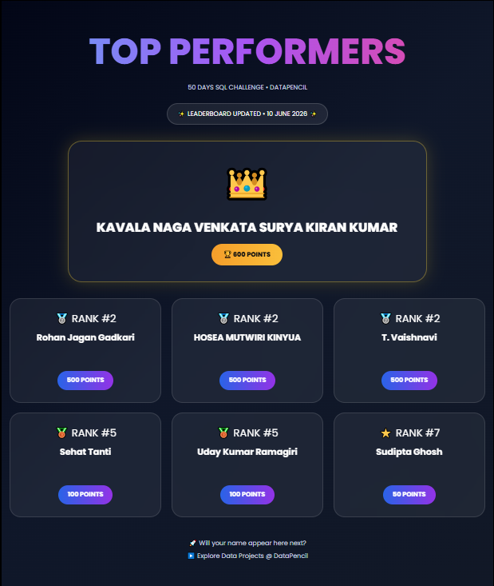
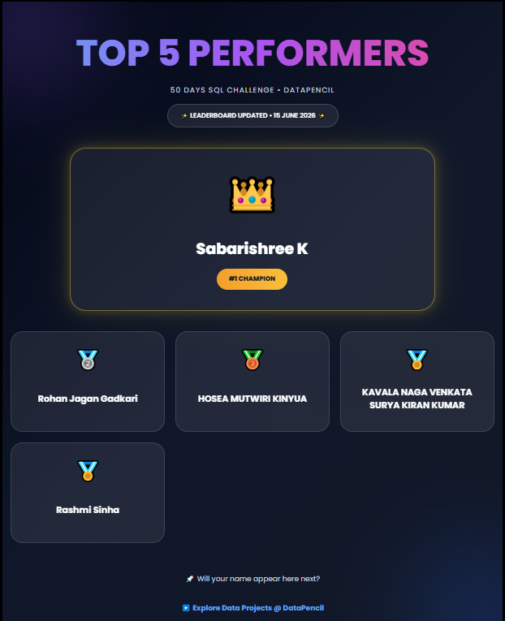
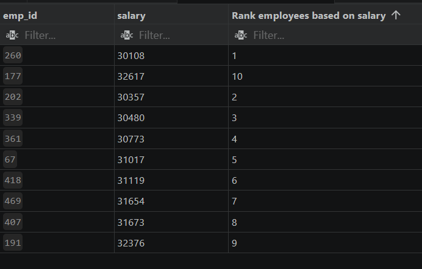
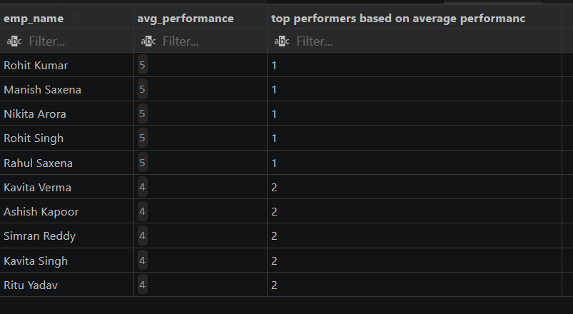
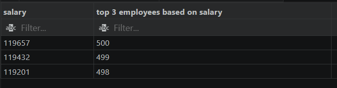

# 50 DAYS SQL - PRACTICE CHALLENGE


| Performance as at 10th June | Performance as at 15th June |
| --- | --- |
|  |  |


[Datapencil challenge](https://datapencil.org/50-days-sql-challenge)
## Day 1: Project Setup

### Objective
Set up the SQL project environment and prepare the dataset for analysis.

### Tasks Completed
- Created project folder structure (dataset, SQL_QUERIES, screenshots)
- Set up SQL database (hr_project)
- Created tables for HR dataset
- Imported messy dataset into database

### Tools Used
- PostgreSQL
- VS Code
- GitHub
- Python 3.13.3

### Outcome
Successfully completed project setup. Ready to start data cleaning and analysis from Day 2.

## Day 2: Data Audit (Messiness Detection)

### Objective
Identify data issues across all tables and columns.

### Tasks Completed
Created cleaned tables
Identified NULL and empty values

### Results/Findings
**Employees and performance** table have empty and NULL values


## Day 3: Data Cleaning (Handling Missing Values)

### Objective
Clean the dataset by handling missing values across multiple tables.

### Tasks Completed
- Created cleaned versions of tables (employees_clean, departments_clean, performance_clean)
- Converted empty values into NULL for consistency
- Replaced NULL and empty values with appropriate defaults

### Key Learning
- NULL and empty values are different but both need to be handled
- Data should not be cleaned directly in raw tables
- Business rules are important while filling missing values


## Day 4: Data Cleaning (Handling Inconsistent Text)
### Objective
* Clean the dataset by fixing inconsistent text values across columns.

### Tasks Completed
1. Identified inconsistent text formats (e.g., HR, hr, Hr)
2. Standardized text using functions like `UPPER()`, `LOWER()`, `INITCAP()`
3. Trimmed extra spaces using TRIM()
4. Replaced incorrect spellings and variations
5. Ensured uniform naming conventions across tables

### Key Learning
* Text inconsistency affects grouping and analysis
* Same values with different formats behave as different data
* Standardization is critical before applying aggregations

## Day 5: Data Cleaning (Handling Invalid Values)
### Objective
* Identify and fix logically incorrect or invalid values in the dataset.
### Tasks Completed
1. Detected invalid values (negative salary, invalid age, incorrect ratings)
2. Applied business rules to define valid ranges
3. Replaced incorrect values using client-provided data
4. Ensured no assumption-based fixes were applied
### Key Learning
* Invalid values are not always missing but logically incorrect
* Data should be corrected using trusted sources (client/system)
* Never blindly manipulate values without business context

## Day 6: Data Cleaning (Outlier Detection & Handling)
### Objective
* Identify and handle extreme values (outliers) in the dataset.

### Outlier Analysis & Updates

1. High Earners Query (Above 75th Percentile)

* This query filters the dataset to identify all employees whose salaries are strictly greater than the **75th percentile (Q3)**. It uses an aggregate subquery with `PERCENTILE_CONT` to dynamically calculate the threshold.

```sql
SELECT * 
FROM challenge_50.clean_salaries
WHERE salary > (
    SELECT PERCENTILE_CONT(0.75) WITHIN GROUP (ORDER BY salary) 
    FROM challenge_50.clean_salaries
);
```

2. Bulk Salary Updates
* This script performs a targeted batch update on specific employee records. It uses a virtual table constructor (`VALUES`) to scale updates efficiently without executing multiple separate `UPDATE` statements.

```sql
UPDATE challenge_50.clean_salaries AS s
SET salary = n.salary
FROM (VALUES
    (17, 35, 65000),
    (37, 262, 97000)
) AS n(salary_id, emp_id, salary)
WHERE s.salary_id = n.salary_id;
```


### Key Learning
* Not all outliers are errors — some are meaningful


---
## Day 7: Data Cleaning
### Objective: Date format fixing
### Task completed
* Identified inconsistent date formats in multiple columns (salary_date, attendance_date, hire_date)
* Detected invalid values (e.g., wrong month, incomplete year, incorrect patterns)
* Replaced incorrect dates with NULL to avoid misleading data
* Standardized all valid dates into a uniform format (YYYY-MM-DD)
* Ensured consistency across all date-related columns

---
## Day 8: Data Cleaning

### Objective:Fix Datatype & Fix Space Issue

* Removed unwanted spaces using `TRIM()` to ensure consistency
* Checked data types across all tables **(employees, departments, salary, performance, attendance)**
* Converted columns to appropriate data types **(INT, VARCHAR, DATE, NUMERIC)**
* Validating data types conversion

---
## Day 9: SQL Tasks
1.  Show only employees who have a valid department
2.  Show all employees (even without department)
3.  Find employees without department
4.  Find who earns how much
5.  List salary records paid to unknown names

---

## Day 10: Joins and Data Analysis

This file contains the SQL queries for the Day 10 challenges, focusing on table joins.


**1. Question:** What are the performance ratings of each employee?

```sql
SELECT 
    e.emp_id, 
    e.emp_name, 
    p.rating_2022, 
    p.rating_2023, 
    p.rating_2024 
FROM challenge_50.clean_employees e 
JOIN challenge_50.clean_performance p ON e.emp_id = p.emp_id;
```

**2. Question:** Which employees do not have any salary records?
```sql
SELECT 
    e.emp_id, 
    e.emp_name, 
    s.salary 
FROM challenge_50.clean_employees e 
LEFT JOIN challenge_50.clean_salaries s ON s.emp_id = e.emp_id 
WHERE s.emp_id IS NULL;
```

**3. Question:** Which employees do not have any attendance records?
```sql
SELECT 
    e.emp_id, 
    e.emp_name, 
    a.status 
FROM challenge_50.clean_employees e 
LEFT JOIN challenge_50.clean_attendance a ON a.emp_id = e.emp_id 
WHERE a.emp_id IS NULL;
```

**4. Question:** What is the employee name, department, and salary together?
```sql
SELECT 
    e.emp_name, 
    d.dept_name, 
    s.salary 
FROM challenge_50.clean_employees e 
JOIN challenge_50.clean_departments d ON d.dept_id = e.dept_id 
JOIN challenge_50.clean_salaries s ON s.emp_id = e.emp_id;
```

---

## Day 11 of the 50-Day SQL Challenge.
The focus of today's challenge istable joins `(INNER JOIN and LEFT JOIN)`, data aggregation`(COUNT, SUM)`, and grouping techniques to extract meaningful employee insights.

### Tasks and Solutions

**Task 1: Employee Performance Overview**

Goal:Retrieve the employee name, department, and performance ratings for the years 2022, 2023, and 2024.

```sql
SELECT 
    e.emp_name, 
    d.dept_name, 
    p.rating_2022, 
    p.rating_2023, 
    p.rating_2024 
FROM challenge_50.clean_employees e 
JOIN challenge_50.clean_performance p ON p.emp_id = e.emp_id 
JOIN challenge_50.clean_departments d ON d.dept_id = e.dept_id;
```

**Task 2: Complete Employee Profile** 

Goal:Build a comprehensive profile for each employee, including their department, salary details, and historical performance ratings.
```sql
SELECT 
    e.emp_name, 
    d.dept_name, 
    s.salary, 
    p.rating_2022, 
    p.rating_2023, 
    p.rating_2024 
FROM challenge_50.clean_employees e 
LEFT JOIN challenge_50.clean_performance p ON p.emp_id = e.emp_id 
JOIN challenge_50.clean_departments d ON d.dept_id = e.dept_id 
JOIN challenge_50.clean_salaries s ON s.emp_id = e.emp_id;
```

**Task 3: Salary Record Count per Employee**

Goal:Determine how many individual salary history records exist for each employee, ordered by their unique employee ID.

```sql
SELECT 
    e.emp_id, 
    e.emp_name, 
    COUNT(s.salary) AS count_salary_records 
FROM challenge_50.clean_employees e 
LEFT JOIN challenge_50.clean_salaries s ON s.emp_id = e.emp_id 
GROUP BY e.emp_id, e.emp_name 
ORDER BY e.emp_id ASC;
```

**Task 4: Total Salary Expenditure per Employee**

Goal: Calculate the cumulative total salary paid out to each employee across all of their available historical records.

```sql
SELECT 
    e.emp_id, 
    e.emp_name, 
    SUM(s.salary) AS total_salary 
FROM challenge_50.clean_employees e 
LEFT JOIN challenge_50.clean_salaries s ON s.emp_id = e.emp_id 
GROUP BY e.emp_id, e.emp_name 
ORDER BY e.emp_id ASC;
```

---
## Day 12: of the 50-Day SQL Challenge.

This file contains the SQL queries for the Day 10 challenges

---

## Task 1: Average Salary by Department
**Goal:** Calculate the average salary for each department and sort the results from lowest to highest.

```sql
SELECT 
    d.dept_name, 
    ROUND(AVG(s.salary), 2) AS average_salary 
FROM challenge_50.clean_departments AS d 
JOIN challenge_50.clean_employees AS e ON e.dept_id = d.dept_id 
JOIN challenge_50.clean_salaries AS s ON s.emp_id = e.emp_id 
GROUP BY d.dept_name 
ORDER BY average_salary;
```

---

### Task 2: Employee Attendance Tracking
**Goal:** Count how many days each employee was present using a conditional block.

```sql
SELECT 
    e.emp_id, 
    e.emp_name, 
    COUNT(a.clean_attendance_date) FILTER(WHERE a.status = 'Present') AS days_present 
FROM challenge_50.clean_employees AS e 
LEFT JOIN challenge_50.clean_attendance AS a ON e.emp_id = a.emp_id 
GROUP BY e.emp_id, e.emp_name 
ORDER BY e.emp_id;
```

---

### Task 3: Department Roster Grouping
**Goal:** Collect and string-aggregate all active employee names who belong to the same department.

```sql
SELECT 
    d.dept_name,
    STRING_AGG(e.emp_name, ', ') AS employees
FROM challenge_50.clean_departments AS d 
JOIN challenge_50.clean_employees AS e ON e.dept_id = d.dept_id 
WHERE e.emp_name != 'Unknown' 
GROUP BY d.dept_name;
```

---

### Task 4: Multi Salary Record Detection
**Goal:** Identify employees who have more than one historical salary entry without using slow nested subqueries.


```sql
SELECT 
    e.emp_name 
FROM challenge_50.clean_employees AS e 
JOIN challenge_50.clean_salaries AS s ON s.emp_id = e.emp_id 
GROUP BY e.emp_id, e.emp_name 
HAVING COUNT(s.salary) > 1;
```
---
## Day 13 of the 50-Day SQL Challenge.

This challenge focuses on using nested subqueries and aggregate functions (`AVG`, `MAX`, `MIN`) to filter employee records based on salary thresholds from a separate table.

---

### 1. Employees Earning More Than Average Salary
Retrieves names of employees whose salary is strictly above the company-wide average.

```sql
-- List employees earning more than average salary 
SELECT e.emp_name 
FROM challenge_50.clean_employees e 
WHERE e.emp_id IN (
    SELECT s.emp_id 
    FROM challenge_50.clean_salaries s 
    WHERE s.salary > (
        SELECT AVG(s.salary) 
        FROM challenge_50.clean_salaries s
    )
);
```

### Concept Breakdown
* **Inner Subquery**: Calculates the statistical average salary.
* **Outer Subquery**: Filters for employee IDs associated with above-average salaries.
* **Main Query**: Matches those IDs to return human-readable employee names.

---

### 2. Employees with Maximum Salary
Retrieves names of employees who earn the absolute highest salary in the database.

```sql
-- List employees with salary equal to maximum salary 
SELECT e.emp_name 
FROM challenge_50.clean_employees e 
WHERE e.emp_id = ALL (
    SELECT s.emp_id 
    FROM challenge_50.clean_salaries s 
    WHERE s.salary = (
        SELECT MAX(s.salary) 
        FROM challenge_50.clean_salaries s
    )
);
```

### Concept Breakdown
* **Inner Subquery**: Finds the highest numeric salary value.
* **ALL Operator**: Evaluates the main query condition against every row returned by the subquery. *(Note: If multiple employees share the max salary, `= ALL` will fail. Using `IN` is safer here).*

---

### 3. Employees Earning Less Than Average Salary
Retrieves names of employees whose salary falls below the company-wide average.

```sql
-- List employees earning less than average 
SELECT e.emp_name 
FROM challenge_50.clean_employees e 
WHERE e.emp_id IN (
    SELECT s.emp_id 
    FROM challenge_50.clean_salaries s 
    WHERE s.salary < (
        SELECT AVG(s.salary) 
        FROM challenge_50.clean_salaries s
    )
);
```

### Concept Breakdown
* **Aggregate Filter**: Operates identically to the first query, but reverses the comparison logic using the less-than (`<`) operator.

---

### 4. Employees with Minimum Salary
Retrieves names of employees earning the absolute lowest salary in the database.

```sql
-- List employees with minimum salary 
SELECT e.emp_name 
FROM challenge_50.clean_employees e 
WHERE e.emp_id = ALL (
    SELECT s.emp_id 
    FROM challenge_50.clean_salaries s 
    WHERE s.salary = (
        SELECT MIN(s.salary) 
        FROM challenge_50.clean_salaries s
    )
);
```

---

## Day 14: SQL 50 Days Challenge

### **Task 1:** List employees earning more than the average salary of their respective departments.

```sql
SELECT 
    e.dept_id, 
    e.emp_name, 
    s.salary 
FROM challenge_50.clean_employees e 
JOIN challenge_50.clean_salaries s 
    ON s.emp_id = e.emp_id 
WHERE salary > (
    SELECT AVG(s2.salary) 
    FROM challenge_50.clean_employees e2 
    JOIN challenge_50.clean_salaries s2 
        ON s2.emp_id = e2.emp_id 
    WHERE e2.dept_id = e.dept_id
);
```

---

### **Task 2:** List employees whose salary is equal to the highest salary in their respective departments.

```sql
SELECT 
    e.dept_id, 
    e.emp_name, 
    s.salary 
FROM challenge_50.clean_employees e 
JOIN challenge_50.clean_salaries s 
    ON s.emp_id = e.emp_id 
WHERE salary = (
    SELECT MAX(s2.salary) 
    FROM challenge_50.clean_employees e2 
    JOIN challenge_50.clean_salaries s2 
        ON s2.emp_id = e2.emp_id 
    WHERE e2.dept_id = e.dept_id
);
```

---

### **Task 3:** List all employees whose salary is equal to the lowest salary in their respective departments.

```sql
SELECT 
    e.dept_id, 
    e.emp_name, 
    s.salary 
FROM challenge_50.clean_employees e 
JOIN challenge_50.clean_salaries s 
    ON s.emp_id = e.emp_id 
WHERE salary = (
    SELECT MIN(s2.salary) 
    FROM challenge_50.clean_employees e2 
    JOIN challenge_50.clean_salaries s2 
        ON s2.emp_id = e2.emp_id 
    WHERE e2.dept_id = e.dept_id
);
```
---

# Day 15: SQL 50 Days Challenge

Today's focus is on using semi-joins and anti-joins via `EXISTS` and `NOT EXISTS`. 

### **Task 1:**  Employees With Salary Records
This query returns all employees who have at least one corresponding record in the salaries table.

```sql
SELECT 
    e.emp_id, 
    e.emp_name 
FROM 
    challenge_50.clean_employees e 
WHERE 
    EXISTS (
        SELECT 1 
        FROM challenge_50.clean_salaries s 
        WHERE e.emp_id = s.emp_id
    ) 
ORDER BY 
    e.emp_id;
```

### **Task 2:**  Employees Without Salary Records
This query identifies employees who have no recorded salary history.

```sql
SELECT 
    e.emp_id,
    e.emp_name 
FROM 
    challenge_50.clean_employees e 
WHERE 
    NOT EXISTS (
        SELECT 1 
        FROM challenge_50.clean_salaries s 
        WHERE s.emp_id = e.emp_id
    ) 
ORDER BY 
    e.emp_id;
```

### **Task 4:**  Employees With Attendance Records
This query lists all employees who have logged at least one attendance entry.

```sql
SELECT 
    e.emp_id,
    e.emp_name 
FROM 
    challenge_50.clean_employees e 
WHERE 
    EXISTS (
        SELECT 1 
        FROM challenge_50.clean_attendance a 
        WHERE a.emp_id = e.emp_id
    ) 
ORDER BY 
    e.emp_id;
```
### **Task 5:** Employees Without Attendance Records


```sql
SELECT 
    e.emp_id,
    e.emp_name 
FROM 
    challenge_50.clean_employees e 
WHERE 
    NOT EXISTS (
        SELECT 1 
        FROM challenge_50.clean_attendance a 
        WHERE a.emp_id = e.emp_id
    ) 
ORDER BY 
    e.emp_id;
```
---


## Day 16: SQL 50 Days Challenge

### **Task 1 :** Calculate total salary paid to each employee


```sql
SELECT 
    e.emp_id,
    e.emp_name, 
    SUM(s.salary) AS total_salary_paid
FROM challenge_50.clean_salaries s
JOIN challenge_50.clean_employees e ON s.emp_id = e.emp_id
GROUP BY e.emp_id, e.emp_name;
```

### **Task 2 :** Average Salary Received by Each Employee

```sql
SELECT 
    e.emp_id,
    e.emp_name, 
    AVG(s.salary) AS average_salary
FROM challenge_50.clean_salaries s
JOIN challenge_50.clean_employees e ON s.emp_id = e.emp_id
GROUP BY e.emp_id, e.emp_name;
```

## **Task 3.** Find maximum salary received by each employee 


```sql
SELECT 
    e.emp_id,
    e.emp_name, 
    MAX(s.salary) AS max_salary
FROM challenge_50.clean_salaries s
JOIN challenge_50.clean_employees e ON s.emp_id = e.emp_id
GROUP BY e.emp_id, e.emp_name;
```

---

## Day 17: SQL 50 Days Challenge

### **Task 1 :** List employees with more than 2 salary records

```sql
SELECT 
    emp_id ,
    COUNT(*) AS emp_count FROM
challenge_50.clean_salaries
GROUP BY emp_id
HAVING COUNT(*) >2;
```
### **Task 2 :** List departments with more than 3employees


```sql
SELECT 
    dept_id,
    COUNT(*) 
FROM challenge_50.clean_employees
GROUP BY dept_id
HAVING COUNT(*) >3
ORDER BY dept_id;
```

### **Task 3 :** List employees with total salary greater than 100000

```sql
SELECT 
    emp_id,
    sum(salary) AS total_salary
FROM challenge_50.clean_salaries
GROUP BY emp_id
HAVING sum(salary)> 100000
ORDER BY emp_id;
```


### **Task 4 :** List departments with high average salary (greater than 50000)

```sql
SELECT 
    emp_id,
    ROUND(AVG(salary),2) AS avg_salary
FROM challenge_50.clean_salaries
GROUP BY emp_id
HAVING AVG(salary)> 50000
ORDER BY emp_id;
```
---
## Day 18: SQL 50 Days Challenge

### 1. High Performing Employees
Employees with an average performance rating greater than 4.

```sql
SELECT 
    e.emp_id, 
    e.emp_name, 
    d.dept_name, 
    ROUND(((p.rating_2022 + p.rating_2023 + p.rating_2024) / 3), 0) AS performance_avg 
FROM challenge_50.clean_employees e 
JOIN challenge_50.clean_performance p ON p.emp_id = e.emp_id 
JOIN challenge_50.clean_departments d ON d.dept_id = e.dept_id 
WHERE ROUND(((p.rating_2022 + p.rating_2023 + p.rating_2024) / 3), 0) > 4;
```

### 2. High Attendance Employees
Employees with more than 10 present days.

```sql
SELECT 
    e.emp_id, 
    e.emp_name, 
    COUNT(a.status) FILTER(WHERE a.status = 'Present') AS present_days 
FROM challenge_50.clean_employees e
JOIN challenge_50.clean_attendance a ON e.emp_id = a.emp_id
GROUP BY e.emp_id, e.emp_name 
HAVING COUNT(a.status) FILTER(WHERE a.status = 'Present') > 10;
```

### 3. High Budget Departments
Departments where the total salary paid is greater than 200,000.

```sql
SELECT 
    d.dept_id, 
    d.dept_name, 
    SUM(s.salary) AS total_salary
FROM challenge_50.clean_employees e 
JOIN challenge_50.clean_departments d ON d.dept_id = e.dept_id 
JOIN challenge_50.clean_salaries s ON e.emp_id = s.emp_id 
GROUP BY d.dept_id, d.dept_name 
HAVING SUM(s.salary) > 200000;
```

### 4. Above Average Earners
Employees whose total salary is greater than their department's average salary.

```sql
SELECT 
    e.emp_id, 
    e.emp_name, 
    SUM(s.salary) AS total_salary
FROM challenge_50.clean_employees e 
JOIN challenge_50.clean_salaries s ON e.emp_id = s.emp_id 
GROUP BY e.emp_id, e.emp_name 
HAVING SUM(s.salary) > ANY (
    SELECT AVG(s2.salary) 
    FROM challenge_50.clean_employees e2 
    JOIN challenge_50.clean_salaries s2 ON e2.emp_id = s2.emp_id 
    WHERE e2.dept_id = (SELECT dept_id FROM challenge_50.clean_employees WHERE emp_id = e.emp_id)
);
```

---
## Day 19: SQL 50 Days Challenge
### Employee Categorization Queries
---

### 1. Salary Categorization (Low / Medium / High)
Categorizes employees based on their current salary threshold.

```sql
SELECT 
    emp_id,
    salary,
    CASE 
        WHEN salary < 30000 THEN 'Low'
        WHEN salary BETWEEN 30000 AND 60000 THEN 'Medium'
        WHEN salary > 60000 THEN 'High'
        ELSE 'N/A'
    END AS salary_category
FROM challenge_50.clean_salaries;
```

---

### 2. Performance Categorization (Good / Average / Poor)
Calculates the 3-year average rating (2022-2024) to determine overall performance.

```sql
SELECT 
    emp_id,
    CASE 
        WHEN ((rating_2022 + rating_2023 + rating_2024) / 3.0) >= 4 THEN 'Good'
        WHEN ((rating_2022 + rating_2023 + rating_2024) / 3.0) >= 3 THEN 'Average'
        ELSE 'Poor'
    END AS performance_category
FROM challenge_50.clean_performance;
```

---

### 3. Attendance Status Categorization (Active / Inactive)
Flags employee status based on their presence record.

```sql
SELECT 
    emp_id,
    CASE 
        WHEN status = 'Present' THEN 'Active'
        ELSE 'Inactive'
    END AS attendance_status
FROM challenge_50.clean_attendance;
```

---

### 4. Experience Level Categorization (Fresher / Mid-Level / Experienced)
Tracks career tenure tiers based on the employee's original hire date.

```sql
SELECT 
    emp_id,
    clean_hire_date,
    CASE 
        WHEN EXTRACT(YEAR FROM AGE(NOW(), clean_hire_date)) < 2 THEN 'Fresher'
        WHEN EXTRACT(YEAR FROM AGE(NOW(), clean_hire_date)) BETWEEN 2 AND 5 THEN 'Mid-Level'
        ELSE 'Experienced'
    END AS experience_level
FROM challenge_50.clean_employees;
```

---


## Day 20: SQL 50 Days Challenge

### **Task 1 :** Retrieve latest salary record for each employee

```SQL
WITH cte AS
(
SELECT 
emp_id,
salary,
clean_salary_date,
ROW_NUMBER() OVER(PARTITION BY emp_id ORDER BY clean_salary_date DESC) AS order_rank
FROM challenge_50.clean_salaries
)
SELECT emp_id,salary,clean_salary_date FROM cte
WHERE order_rank = 1;
```


### **Task 2 :** Retrieve first(oldest) salary record for each employee

```SQL
SELECT * FROM
(
    SELECT 
    emp_id,
    salary,
    clean_salary_date,
    ROW_NUMBER() OVER(PARTITION BY emp_id ORDER BY clean_salary_date ASC) AS order_rank
    FROM challenge_50.clean_salaries
)
WHERE order_rank = 1;
```

### **Task 3 :** Rank salary entries for each employee

```SQL
SELECT 
    emp_id,
    salary,
    clean_salary_date,
    RANK() OVER(ORDER BY salary ASC) AS salary_rank
FROM challenge_50.clean_salaries
```

### **Task 4 :** Get top 2 salary records per employee

```SQL
WITH cte AS
(
    SELECT 
    emp_id,
    salary,
    clean_salary_date,
    ROW_NUMBER() OVER(PARTITION BY emp_id ORDER BY salary DESC) AS order_rank
    FROM challenge_50.clean_salaries
)
SELECT emp_id,salary,clean_salary_date,order_rank FROM cte
WHERE order_rank IN (1,2);
```
---


## Day 21: SQL 50 Days Challenge

### **Task 1 :** Rank employees based on salary
```SQL
SELECT
    emp_id,
    salary,
    RANK()OVER(ORDER BY salary) "Rank employees based on salary"
FROM challenge_50.clean_salaries
LIMIT 10;
```

**Output:**




### **Task 2 :** Perform department-wise ranking of employees

```SQL
SELECT
    e.emp_id,
    e.emp_name,
    e.dept_id,
    s.salary,
    DENSE_RANK()OVER(PARTITION BY e.dept_id ORDER BY s.salary) "department-wise ranking of employees"
FROM challenge_50.clean_employees e
JOIN challenge_50.clean_salaries s
ON s.emp_id = e.emp_id;
```

### **Task 3 :** Identify top performers based on average performance rating

```SQL
SELECT 
    emp_name,
    avg_performance,
    DENSE_RANK()OVER(ORDER BY avg_performance DESC) "top performers based on average performanc"
FROM(
    SELECT
    e.emp_id,
    e.emp_name,
    ((p.rating_2022+p.rating_2023+p.rating_2024)/3) Avg_performance 
    FROM challenge_50.clean_performance p
    JOIN challenge_50.clean_employees e
    ON e.emp_id = p.emp_id
)
LIMIT 10;
```


**Output:**




### **Task 4 :** Find top 3 employees based on salary ranking

```SQL
SELECT
    salary,
    RANK()OVER(ORDER BY salary) "top 3 employees based on salary"
FROM challenge_50.clean_salaries
ORDER BY salary DESC
LIMIT 3;
```

**Output:**




---


## Day 22: SQL 50 Days Challenge


### **Task 1:** Show each employee with average salary of their department

```sql
-- • Show each employee with average salary of their department
WITH cte AS
(
    SELECT 
        e.emp_id,
        e.dept_id,
        s.salary,
        ROUND(AVG(s.salary) OVER(PARTITION BY e.dept_id),2) avg_salary
    FROM challenge_50.clean_employees e
    JOIN challenge_50.clean_salaries s
    ON s.emp_id = e.emp_id
)
SELECT *
FROM cte
WHERE salary>avg_salary;
```
---


### **Task 2:** Show total salary of each department for every employee

```sql
-- •Show total salary of each department for every employee
SELECT 
    e.emp_id,
    e.dept_id,
    s.salary,
    ROUND(AVG(s.salary) OVER(),2) total_salary
FROM challenge_50.clean_employees e
JOIN challenge_50.clean_salaries s
ON s.emp_id = e.emp_id
```
---

### **Task 3:** Show average performance rating of each department
```SQL
-- • Show average performance rating of each department

WITH cte2 AS
(
    SELECT 
        e.emp_id,
        e.dept_id,
        ((p.rating_2022+p.rating_2023+p.rating_2024)/3) avg_ratings
    FROM challenge_50.clean_employees e
    JOIN challenge_50.clean_performance p
    ON p.emp_id = e.emp_id

)
SELECT 
    emp_id,
    dept_id,
    avg_ratings,
    ROUND(AVG(avg_ratings)OVER(PARTITION BY dept_id),2) avg_rating_department_wise
FROM cte2;
```
---


## Day 23: SQL 50 Days Challenge

### **Task 1:** Track Salary History
```sql
-- Show current salary along with previous salary for each employee

SELECT 
    emp_id,
    salary,
    clean_salary_date,
    LAG(salary) OVER(PARTITION BY emp_id ORDER BY clean_salary_date) AS lag_salary
FROM challenge_50.clean_salaries
```

### **Task 2:** Calculate Salary Variance

```sql
-- Calculate difference between current salary and previous salary

SELECT 
    emp_id,
    salary,
    clean_salary_date,
    LAG(salary) OVER(PARTITION BY emp_id ORDER BY clean_salary_date) AS lag_salary,
    (salary-LAG(salary) OVER(PARTITION BY emp_id ORDER BY clean_salary_date)) AS salary_change
FROM challenge_50.clean_salaries;
```

### **Task 3:** Multi-Year Performance Lookback

```sql
-- Analyze performance trend (compare current status with previous status)

WITH cte2 AS 
(
SELECT
    p.emp_id,
    c.year,
    c.rating
FROM challenge_50.clean_performance p
CROSS JOIN LATERAL(
    VALUES
        (2022,p.rating_2022),
        (2023,p.rating_2023),
        (2024,p.rating_2024)
    ) AS c(year,rating)
),
cte3 AS
(
    SELECT *,
    LAG(rating,1,0) 
        OVER(
        PARTITION BY emp_id ORDER BY year
        ) AS lag_rating
    FROM cte2
)
SELECT 
*,
LAG(lag_rating,1,0) 
    OVER(
    PARTITION BY emp_id ORDER BY year
    ) AS lag_rating_2
FROM cte3

```
---

## Day 24: SQL 50 Days Challenge


### **Task 1:** Salary Progression

```sql
-- Show current salary along with next salary for each employee

SELECT 
    emp_id,
    salary_id,
    clean_salary_date,
    salary,
    LEAD(salary) OVER(PARTITION BY emp_id ORDER BY clean_salary_date) as next_salary
FROM challenge_50.clean_salaries;
```


### **Task 2:** Salary Growth Analysis

```sql
-- Compare current salary with next salary for growth analysiS

SELECT 
    emp_id,
    salary_id,
    clean_salary_date,
    salary,
    next_salary,
    CONCAT(ROUND((((next_salary - salary)/salary)*100),2),'%') as salary_growth
FROM
(   
    SELECT 
        emp_id,
        salary_id,
        clean_salary_date,
        salary,
        LEAD(salary) OVER(PARTITION BY emp_id ORDER BY clean_salary_date) as next_salary
    FROM challenge_50.clean_salarieS
);

```
### **Task 3:** Attendance Trend Prediction

```sql
-- Predict attendance trend by comparing current and next status
SELECT
    attendance_id,
    emp_id,
    clean_attendance_date,
    status,
    LEAD(status) OVER(PARTITION BY emp_id ORDER BY clean_attendance_date) as next_attandance_status
FROM challenge_50.clean_attendance;
```
---


## Day 25: SQL 50 Days Challenge

### **Task 1:** Employee Running Total Salary
```sql
-- Calculate running total salary for each employee overtime

SELECT
    salary_id,
    emp_id,
    salary,
    clean_salary_date,
    SUM(salary) OVER(PARTITION BY emp_id ORDER BY clean_salary_date) AS running_total
FROM challenge_50.clean_salaries;

```
### **Task 2:** Employee Running Attendance Count


```sql
-- Calculate running attendance count for each employee

SELECT
    emp_id,
    attendance_id,
    status,
    clean_attendance_date,
    COUNT(attendance_id) FILTER(WHERE status != 'Absent') OVER(PARTITION BY emp_id ORDER BY clean_attendance_date) AS attendance_count

FROM challenge_50.clean_attendance
```


### **Task 3:** Department Cumulative Salary

```sql

-- Calculate cumulative salary for each department over time

SELECT 
    s.salary_id,
    e.emp_id,
    d.dept_id,
    d.dept_name,
    s.salary,
    s.clean_salary_date,
    SUM(s.salary) OVER(PARTITION BY d.dept_id ORDER BY s.clean_salary_date) AS cumulative_salary_each_department
FROM challenge_50.clean_salaries s
JOIN challenge_50.clean_employees e
ON s.emp_id = e.emp_id
JOIN challenge_50.clean_departments d
ON e.dept_id = d.dept_id
```
---


## Day 26: SQL 50 Days Challenge

### **Task 1:** Departmental Salary Ranking


```sql
-- Find rank of employees within each department based on salary

SELECT
    e.emp_id,
    e.emp_name,
    e.dept_id,
    s.salary,
    DENSE_RANK() OVER(PARTITION BY e.dept_id ORDER BY s.salary) employee_rank
FROM challenge_50.employees e
JOIN challenge_50.salaries s
ON s.emp_id = e.emp_id;
```


### **Task 2:** Salary Comparison Against Department Average

```sql

-- Compare each employee’s salary with their department average(AboveAvg/BelowAvg/Equal)

WITH cte AS
(
    SELECT
        e.emp_id,
        e.emp_name,
        e.dept_id,
        s.salary,
        ROUND(AVG(s.salary) OVER(PARTITION BY e.dept_id),2) dept_avg_salary
    FROM challenge_50.employees e
    JOIN challenge_50.salaries s
    ON s.emp_id = e.emp_id
)
SELECT 
    emp_id,
    emp_name,
    dept_id,
    salary,
    dept_avg_salary,
    CASE WHEN salary > dept_avg_salary THEN 'AboveAvg'
        WHEN salary < dept_avg_salary THEN 'BelowAvg'
        WHEN salary = dept_avg_salary THEN 'Equal'
    END saray_comparison
FROM cte;
```


### **Task 3:** Top 3 Highest Paid Employees per Department

```sql
-- Find top 3 highest paid employees in each department

SELECT * FROM
(
    SELECT
        e.emp_id,
        e.emp_name,
        e.dept_id,
        s.salary,
        DENSE_RANK() OVER(PARTITION BY e.dept_id ORDER BY s.salary DESC) employee_rank
    FROM challenge_50.employees e
    JOIN challenge_50.salaries s
    ON s.emp_id = e.emp_id
)
WHERE employee_rank IN (1,2,3);
```


### **Task 4:** Lowest Paid Employee per Department

```sql
-- Find lowest salary employee in each department

SELECT * FROM
(
    SELECT
        e.emp_id,
        e.emp_name,
        e.dept_id,
        s.salary,
        DENSE_RANK() OVER(PARTITION BY e.dept_id ORDER BY s.salary ASC) employee_rank
    FROM challenge_50.employees e
    JOIN challenge_50.salaries s
    ON s.emp_id = e.emp_id
)
WHERE employee_rank = 1;
```
---


## Day 27: SQL 50 Days Challenge

### **Task 1:** Individual Salary vs. Overall Average
```sql
/*
==================================================================================
Compare each employee's salary with overall average salary 
(> avg → Above Avg, < avg →
Below Avg,= avg → Equal)
==================================================================================
*/

SELECT 
    emp_id,
    salary,
    avg_salary,
    CASE WHEN salary >avg_salary THEN 'Above Avg'
        WHEN salary < avg_salary THEN 'Below Avg'
        WHEN salary = avg_salary THEN 'Equal'
    END salary_comparison
FROM
(
    SELECT
        emp_id,
        salary,
        ROUND(AVG(salary) OVER(),2) avg_salary
    FROM challenge_50.clean_salaries
);
```


### **Task 2:** Salary Contribution to Total Payroll

```sql
/*
==================================================================================
Compare employee salary with total salary of all employees
(salary > 10% of total salary → High Contributor, else → Low
Contributor)
==================================================================================
*/

SELECT 
    emp_id,
    salary,
    total_salary,
    CASE WHEN ((salary*100)/total_salary) > 10 THEN 'High Contributor'
        ELSE 'Low Contributor'
    END comparison_with_total_salary
FROM
(
    SELECT
        emp_id,
        salary,
        SUM(salary) OVER() total_salary
    FROM challenge_50.clean_salaries
);

```


### **Task 3:** Department Cost vs. Overall Total Payroll
```sql

/*
==================================================================================
Compare department total salary with 
overall total salary (dept total > 30% of total →
High Dept, else → Low Dept)
==================================================================================
*/


SELECT 
    emp_id,
    salary,
    total_salary_by_dept,
    total_salary,
    CASE WHEN ((total_salary_by_dept*100)/total_salary) > 30 THEN 'High Dept'
        ELSE 'Low Dept'
    END dept_comparison_with_total_salary
FROM
(
    SELECT
        s.emp_id,
        s.salary,
        e.dept_id,
        SUM(s.salary) OVER(PARTITION BY e.dept_id) total_salary_by_dept,
        SUM(s.salary) OVER() total_salary

    FROM challenge_50.clean_salaries s
    JOIN challenge_50.clean_employees e
    ON s.emp_id = e.emp_id
);
```
---